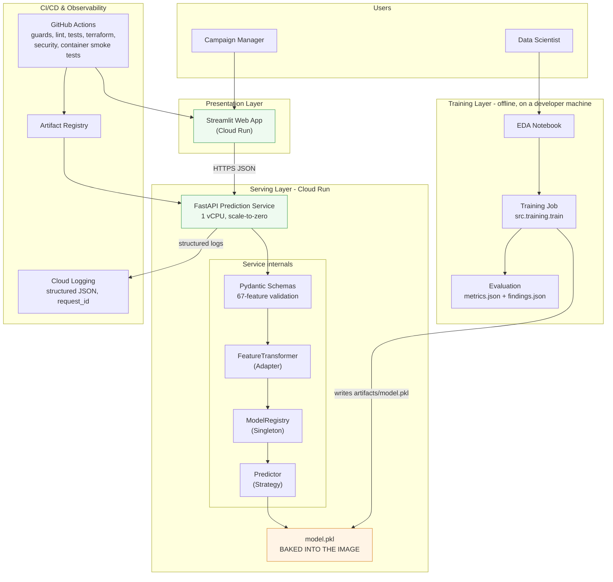
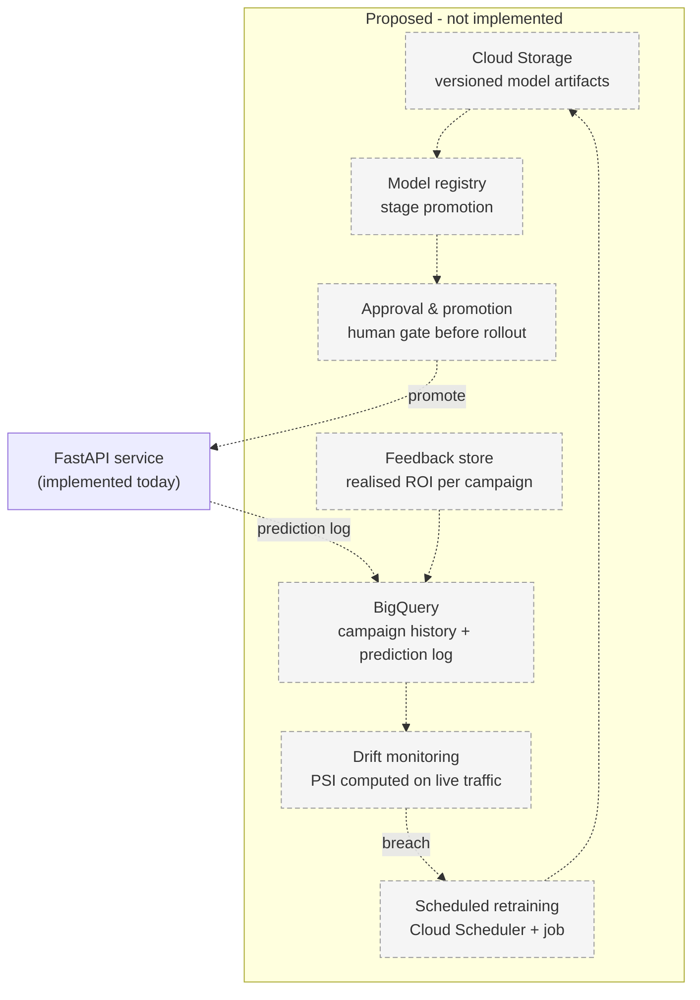
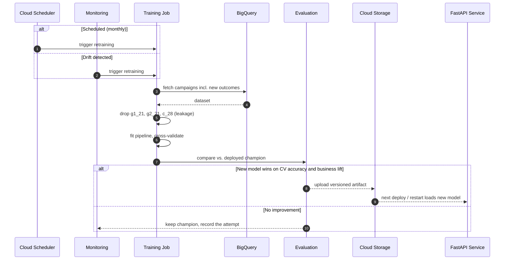

# System Architecture

Answers **Engineering Challenge item 1**: a high-level technical architecture diagram and
a sequence diagram illustrating interactions between components.

Both diagrams are written in Mermaid. They render natively on GitHub, in VS Code, and can
be exported as PNG/SVG at <https://mermaid.live> for the slide deck.

---

## 1. Architecture

Two diagrams, deliberately separated.

A single diagram covering both what runs and what is planned is the most common way an
architecture document misleads, and it does so while looking thorough. A reader cannot tell
which boxes they could go and curl. An earlier version of this page had exactly that problem:
one diagram showed Cloud Storage loading the model at startup, BigQuery receiving a prediction
log, and drift alerts triggering retraining. None of those exist. All three are named as
unbuilt in the final report's limitations, so the document contradicted itself - and the
diagram, being the part people actually look at, was the copy that lied.

### 1.1 Implemented today

Everything below is deployed and can be verified: the endpoints answer, the image exists in
Artifact Registry, the logs are queryable.



Note what is absent, because each absence is a deliberate scope decision rather than an
oversight: no model registry, no feature store, no database, no message queue, no separate
load balancer. The artifact ships inside the image, which is why a new model requires a new
revision - and why rollback is a revision rollback rather than a config change.

### 1.2 Target architecture - PROPOSED, none of this is built

Nothing in this diagram exists. It is the shape the system would take once retraining is
routine rather than occasional, and it is included to show the seams were considered, not to
imply they were implemented.



The single dependency worth noting: every box here needs the feedback store first. Without
realised ROI per campaign there is nothing to retrain *on*, nothing to compute drift
*against*, and no basis for an approval decision. That is why the final report's next steps
put obtaining a campaign identifier above any modelling work.

Once that store exists the loop closes: the campaign management system asks the API which
group to target, the execution layer runs the campaign, the realised ROI of **both** groups
lands back in BigQuery, and that becomes the next training row. That is the integration point
the brief asks about - the model as a component of the marketing platform rather than a
standalone demo. Today the loop is open, and the open end is the feedback store.

### What is built today vs. what §1.2 proposes

Restating the split as a table, because a reader checking one specific capability should not
have to infer it from which of two diagrams a box appeared in:

| Component | Status | Note |
|---|---|---|
| FastAPI prediction service | ✅ **Deployed** | Cloud Run, `europe-west3`, autoscaled, scale-to-zero |
| Streamlit web app | ✅ **Deployed** | Second Cloud Run service |
| Pydantic schemas, Adapter, Registry, Strategy, Decision layer | ✅ **Built and tested** | `src/`, exercised by the test suite |
| Training job | ✅ **Built** | `python -m src.training.train`, reproducible, single command |
| CI (data guard, lint, format, types, tests, security, image build, container smoke test) | ✅ **Running** | GitHub Actions, `.github/workflows/ci.yml`. Training is deliberately absent — the dataset is never committed, so CI has nothing to train on |
| Model artifact storage | ⚠️ **Baked into the image** | Not Cloud Storage. Adequate for one model; the registry loads through one seam, so moving to GCS changes a path, not a design |
| Drift monitoring | ⚠️ **Reference captured; nothing computes PSI at runtime** | Training persists quantile bins into the artifact and `src/drift.py` computes PSI against them, but **the API does not call it** — there is no request-time drift path and nothing pages anyone. The reference exists so that the check is possible later without a retrain |
| BigQuery, Cloud Scheduler, prediction log | ❌ **Proposed** | The retraining loop in §3 is a design, not a running pipeline |

Everything marked ⚠️ or ❌ is a deliberate scope decision for a take-home, not an
oversight. The reason the migration is cheap is that the seams already exist: the model is
a serialised artifact loaded through `ModelRegistry`, and the predictor sits behind
`BasePredictor`. Pointing the registry at Cloud Storage or swapping the CSV loader for a
BigQuery client touches one class each.

### Component responsibilities

| Component | Responsibility |
|---|---|
| Campaign Management System | Source of candidate group pairs; consumes the recommended action and records which group was targeted. The primary machine consumer of the API. |
| Campaign Execution | Runs the campaign on the recommended group and reports realised ROI per group back to the warehouse. |
| Streamlit Web App | Human interface for ad-hoc scoring and for inspecting a recommendation before committing budget. Holds no business logic. |
| Load Balancer | TLS termination, routing, rate limiting. |
| FastAPI service | Validates input, adapts it to the model contract, returns a prediction plus the recommended action. |
| Pydantic Schemas | Reject malformed payloads — and any post-campaign variable — before the model is touched. |
| FeatureTransformer (Adapter) | Converts nested JSON into the canonical 67-column frame. |
| ModelRegistry (Singleton) | Loads the artifact once per container and shares it across requests. |
| Predictor (Strategy) | Interchangeable model implementations behind one interface. |
| Cloud Storage | Versioned model artifacts and metrics. |
| BigQuery | Historical campaign data plus every served prediction, for monitoring and retraining. |
| Training job | Reproducible pipeline producing `model.pkl` and `metrics.json`. |
| GitHub Actions | Lint, format check, tests with coverage gate, image build. |
| Cloud Monitoring | Latency, error rate, class-distribution drift; triggers retraining. |

### Platform choice: Cloud Run vs. Vertex AI

Vertex AI was evaluated and deliberately not used. The reasoning, and the conditions that
would reverse it:

| Vertex service | Purpose | Decision for this system | Migration trigger |
|---|---|---|---|
| **Endpoints** | Managed serving, autoscaling, GPU | **No.** Inference is a CPU-bound scikit-learn pipeline at ~30 ms. Endpoints hold a minimum replica and do not scale to zero, so an idle demo costs roughly €50-100/month against ~€0 on Cloud Run. | Traffic becomes continuous rather than bursty, or a GPU-bound model is adopted |
| **Model Registry** | Versioning, lineage, stage promotion | **Not yet.** The artifact already embeds `model_version`, `trained_at`, offline metrics and `dataset_sha256`, exposed at `/model/info`. | More than one model in production, or an approval workflow between training and serving |
| **Pipelines** | Multi-step orchestration | **No.** Training is a single reproducible script that completes in ~6 minutes. | Training spans multiple compute steps, or scheduled retraining needs retries and lineage across stages |
| **Feature Store** | Low-latency online feature serving | **No.** All 67 features arrive in the request body; nothing is looked up at inference time. | Features must be joined from the warehouse at request time, or training/serving skew appears in feature computation |
| **Experiments** | Run tracking and comparison | **No — MLflow covers it.** Every training run logs parameters, per-model metrics, the champion artifact and the dataset hash, with one nested child run per candidate. A local `mlruns/` file store needs no server; `--tracking-uri` points the same code at a shared one. | A shared tracking server is required, or run history must be governed alongside other GCP resources |

**Principle applied.** Managed MLOps platforms earn their operational and financial cost at
a scale this system does not have: one model, one training script, sub-100 ms CPU
inference, bursty traffic. Adopting them now would add cost and indirection without
removing any real constraint.

The migration path is nonetheless short, because the boundaries are already correct: the
model is a serialised artifact loaded through `ModelRegistry`, and the predictor sits
behind an interface (`BasePredictor`). Moving to Vertex Endpoints means changing where the
artifact is loaded from and which container the same FastAPI app runs in - not rewriting
the service.

### Why Cloud Run

Traffic is bursty (campaign planning sessions, not continuous load), the model is a
single CPU-bound artifact, and scale-to-zero keeps the cost near zero between campaigns.
A GKE deployment would add operational overhead with no benefit at this scale.

---

## 2. Sequence diagram — single prediction

```mermaid
sequenceDiagram
    autonumber
    actor CM as Campaign Manager
    participant CMP as Campaign Platform
    participant API as FastAPI Service
    participant SCH as Pydantic Schema
    participant ADP as FeatureTransformer
    participant REG as ModelRegistry
    participant MDL as Predictor (Pipeline)
    participant DEC as Decision Layer
    participant LOG as Cloud Logging

    Note over REG,MDL: Container startup (once)
    REG->>MDL: load /app/artifacts/model.pkl (baked into the image)
    MDL-->>REG: fitted pipeline + metadata
    Note over REG,MDL: Startup canary scores one synthetic campaign;<br/>on failure the container never becomes ready

    CM->>CMP: Plan campaign, pick two candidate groups
    CMP->>API: POST /predict {group_1, group_2, comparison}

    API->>SCH: validate payload
    alt Missing / unexpected / post-campaign key
        SCH-->>API: ValidationError
        API-->>CMP: 422 {error, detail}
        CMP-->>CM: Show which fields are wrong
    else Payload valid
        SCH-->>API: ComparisonRequest
        API->>ADP: from_payload(...)
        ADP-->>API: DataFrame (1 x 67, canonical order)
        API->>REG: get active predictor
        REG-->>API: Predictor
        API->>MDL: predict(frame)
        Note right of MDL: pairwise diffs/ratios ->
        Note right of MDL: impute -> scale -> model
        MDL-->>API: class + class probabilities

        opt ENABLE_DECISION_LAYER=true (OFF by default)
            API->>DEC: decide(probabilities, cost matrix)
            Note right of DEC: minimise expected cost, not argmax.<br/>Off by default: the cost matrix is assumed,<br/>not supplied by the business
            DEC-->>API: action + expected costs + review flag
        end

        API->>LOG: log(class, action, confidence, latency, request_id)
        API-->>CMP: 200 {predicted_class, label, description,<br/>confidence, probabilities, model_version,<br/>decision (only when enabled)}

        alt Confidence below the automation gate, or costs nearly tied
            CMP-->>CM: Escalate to a human
            CM->>CMP: Human decides
        else Confidence clears the frozen gate
            CMP-->>CM: "Target customer group 2" - act automatically
        end
    end
```

The escalation branch is not decoration. The automation threshold is selected on a
held-out calibration split by a stated rule and then frozen, so roughly two thirds of
campaigns route to a human and one third is decided automatically at materially higher
accuracy. The exact operating point is in `reports/findings.json` under `automation_gate`;
the service returns `review_required` and never suppresses that decision silently.

---

## 3. Sequence diagram — retraining loop



---

## 4. Design patterns used

| Pattern | Where | Why |
|---|---|---|
| Strategy | `BasePredictor` → `SklearnPipelinePredictor`, `MajorityClassPredictor` | Swap models without touching the API. |
| Factory | `ModelFactory.create()` / `.register()` | Add predictors without editing conditionals (Open/Closed). |
| Singleton | `ModelRegistry` | Deserialise the artifact once per process. |
| Adapter | `FeatureTransformer` | Isolate the model from the HTTP payload shape. |
| Dependency Injection | FastAPI `Depends` | Override collaborators in tests, no global state in handlers. |
| Application Factory | `create_app()` | Build isolated app instances per test. |
| Pipeline (Composite) | sklearn `Pipeline` | One object owns preprocessing + model, killing training/serving skew. |

---

## 5. Non-functional considerations

**Scalability** — stateless containers; Cloud Run autoscales on concurrency. Batch
endpoint amortises overhead for campaign-wide scoring.

**Latency** — measured, not asserted. 50 requests against the deployed service from a
developer machine in Germany (`scripts/measure_latency.py`, raw output in
`reports/latency.json`, 0 failures):

| | ms |
|---|---|
| min | 69.8 |
| median | 79.0 |
| mean | 84.7 |
| **p95** | **115.8** |
| p99 / max | 182.3 |
| first request, warm container | 935.7 |

Percentiles rather than a mean, because a mean hides the tail and the tail is what times
out. These include internet round-trip, so service-side latency is lower.

**The cold start is the finding.** Steady-state performance is comfortable — **median 79 ms,
p95 116 ms** end-to-end, with the model loaded once at container startup rather than per
request. (An earlier revision measured 129/178; the improvement came with the slimmed serving
image and is recorded here rather than quietly replacing the old figure.) But a scale-to-zero service pays container start, image pull and deserialisation of a
47 MB artifact on the first request after an idle period.

**How long that takes is *not* something this project has measured repeatably**, and the
distinction matters. A single observation against a genuinely cold container recorded roughly
15 seconds; the run recorded above reached a container Cloud Run had kept warm, and its first
request took 1.2 seconds. Those are different situations, not a range: the 15 s figure is one
observation and is **not** the number in `latency.json`. The honest statement is *"of the order
of seconds, observed once at ~15 s"* rather than a figure quoted as though established.

An earlier version of this document quoted 15.5 s and sub-100 ms p95 while `latency.json` held
different values — a contradiction found in review, not by me. **The table above previously
reproduced that same defect**, carrying median 37.1 ms and p95 91.0 ms from a superseded
100-request run while the paragraph beneath it, the model card and the final report all quoted
129/178 from the current file. Every figure in this section is now read from
`reports/latency.json`; the only number that is not is the 15 s cold-start observation, and it
is labelled as such.

For campaign planning a slow first request is defensible: sessions are bursty, one person
absorbs the wait once per session, and the alternative is paying for an always-warm instance
between campaigns. But it is a real trade-off with a name, not an oversight, and it should be
revisited if either of two things becomes true — the API acquires a machine consumer that
retries on timeout, or the frontend's first-load experience is judged unacceptable. The
lever is `api_min_instances` in `terraform/variables.tf`, currently 0.

One caveat on this measurement: it was taken against an image built **before** the serving
container was slimmed to `requirements-serve.txt`. Image pull is a large share of cold
start, so the current figure should fall materially after the next deploy — worth
re-measuring rather than assuming.

**Reliability** — `/health` drives readiness probes. `ALLOW_BASELINE_FALLBACK=false` in
production means a bad artifact fails the deploy rather than silently serving a baseline.

**Security** — no PII in the payload (aggregate group statistics only); non-root
container user; CORS restricted to the frontend origin in production.

### Authentication and rate limiting — stated, not implemented

**The deployed service is intentionally unauthenticated, and this is a submission decision
rather than an oversight.** It exists so the API can be evaluated by opening a URL. Handing a
credential to three reviewers by email would be worse practice than the exposure it prevents,
and the endpoint carries no personal data — the payload is 67 aggregate group statistics and
the response is a targeting recommendation.

**What production requires instead, and why each choice sits where it does:**

| Control | Where | Why not in the application |
|---|---|---|
| Authentication | Remove `--allow-unauthenticated`; caller holds `roles/run.invoker` | Cloud Run checks the IAM token before the container is reached. An in-app API key would still require the request to be admitted, scheduled and parsed first |
| Rate limiting | Cloud Armor at the load balancer | An in-process limiter on a scale-to-zero service limits *per instance*. Cloud Run adds instances under load, so the effective global limit rises exactly when a limit is needed. The constraint belongs to the edge |
| Quota per caller | API Gateway or Apigee | Per-consumer quotas need an identity the service does not have |

The Terraform change is two lines. The reason it is not applied is that a reviewer clicking a
link and receiving `401` learns less about this system than a reviewer receiving a prediction.

**One control that is *not* deferred:** input validation. Rejecting non-finite values,
implausible magnitudes and mostly-null payloads is enforced in the Pydantic schema, because
that is a correctness property rather than a perimeter one. A campaign must never be approved
from an empty request, and no amount of authentication would have prevented that.

**Governance** — every artifact carries `model_name`, `model_version`, `trained_at` and
its offline metrics, exposed at `/model/info` so any prediction can be traced to a model.
