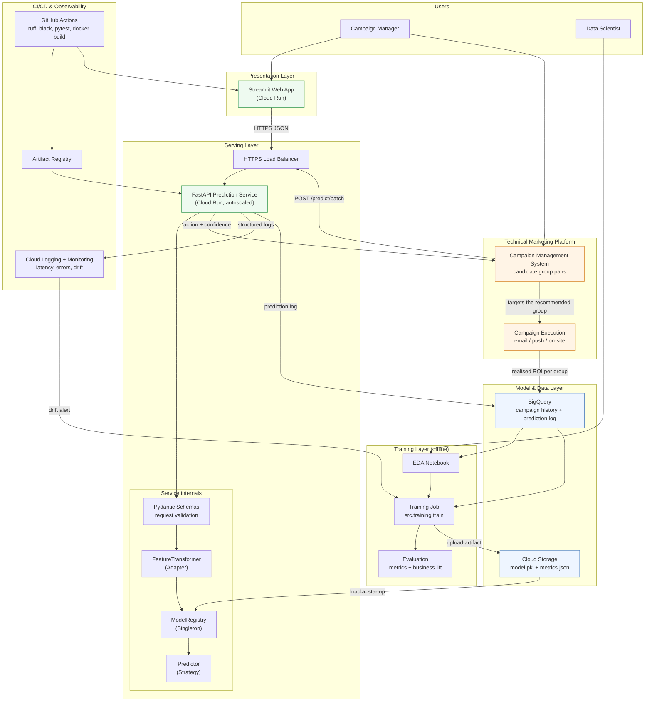
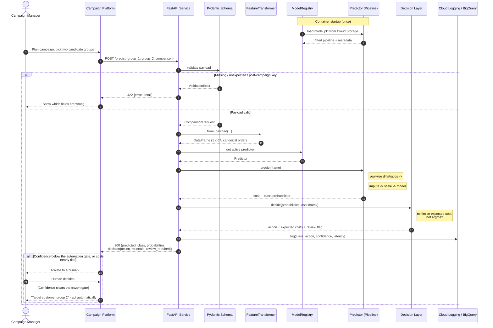
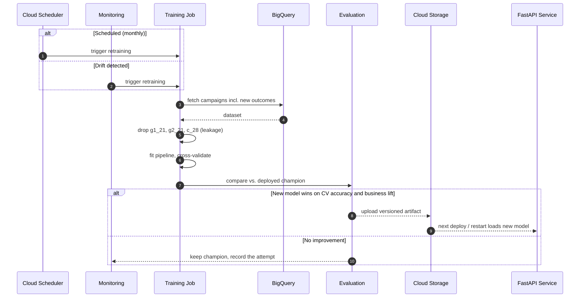

# System Architecture

Answers **Engineering Challenge item 1**: a high-level technical architecture diagram and
a sequence diagram illustrating interactions between components.

Both diagrams are written in Mermaid. They render natively on GitHub, in VS Code, and can
be exported as PNG/SVG at <https://mermaid.live> for the slide deck.

---

## 1. High-level technical architecture

The loop closes: the campaign management system asks the API which group to target, the
execution layer runs the campaign, the realised ROI of **both** groups lands back in
BigQuery, and that becomes the next training row. This is the integration point the brief
asks about - the model is a component of the marketing platform, not a standalone demo.

### What is built today vs. what the diagram proposes

The diagram above is the **target architecture**. Not all of it is deployed, and it would
be misleading to present it as if it were. The boundary is explicit:

| Component | Status | Note |
|---|---|---|
| FastAPI prediction service | ✅ **Deployed** | Cloud Run, `europe-west3`, autoscaled, scale-to-zero |
| Streamlit web app | ✅ **Deployed** | Second Cloud Run service |
| Pydantic schemas, Adapter, Registry, Strategy, Decision layer | ✅ **Built and tested** | `src/`, exercised by the test suite |
| Training job | ✅ **Built** | `python -m src.training.train`, reproducible, single command |
| CI (data guard, lint, format, types, tests, security, image build, container smoke test) | ✅ **Running** | GitHub Actions, `.github/workflows/ci.yml`. Training is deliberately absent — the dataset is never committed, so CI has nothing to train on |
| Model artifact storage | ⚠️ **Baked into the image** | Not Cloud Storage. Adequate for one model; the registry loads through one seam, so moving to GCS changes a path, not a design |
| Drift monitoring | ⚠️ **Reference captured; nothing computes PSI at runtime** | Training persists quantile bins into the artifact and `src/drift.py` computes PSI against them, but **the API does not call it** — there is no request-time drift path and nothing pages anyone. The reference exists so that the check is possible later without a retrain |
| BigQuery, Cloud Scheduler, prediction log | ❌ **Proposed** | The retraining loop in §3 is a design, not a running pipeline |

Everything marked ⚠️ or ❌ is a deliberate scope decision for a take-home, not an
oversight. The reason the migration is cheap is that the seams already exist: the model is
a serialised artifact loaded through `ModelRegistry`, and the predictor sits behind
`BasePredictor`. Pointing the registry at Cloud Storage or swapping the CSV loader for a
BigQuery client touches one class each.

### Component responsibilities

| Component | Responsibility |
|---|---|
| Campaign Management System | Source of candidate group pairs; consumes the recommended action and records which group was targeted. The primary machine consumer of the API. |
| Campaign Execution | Runs the campaign on the recommended group and reports realised ROI per group back to the warehouse. |
| Streamlit Web App | Human interface for ad-hoc scoring and for inspecting a recommendation before committing budget. Holds no business logic. |
| Load Balancer | TLS termination, routing, rate limiting. |
| FastAPI service | Validates input, adapts it to the model contract, returns a prediction plus the recommended action. |
| Pydantic Schemas | Reject malformed payloads — and any post-campaign variable — before the model is touched. |
| FeatureTransformer (Adapter) | Converts nested JSON into the canonical 67-column frame. |
| ModelRegistry (Singleton) | Loads the artifact once per container and shares it across requests. |
| Predictor (Strategy) | Interchangeable model implementations behind one interface. |
| Cloud Storage | Versioned model artifacts and metrics. |
| BigQuery | Historical campaign data plus every served prediction, for monitoring and retraining. |
| Training job | Reproducible pipeline producing `model.pkl` and `metrics.json`. |
| GitHub Actions | Lint, format check, tests with coverage gate, image build. |
| Cloud Monitoring | Latency, error rate, class-distribution drift; triggers retraining. |

### Platform choice: Cloud Run vs. Vertex AI

Vertex AI was evaluated and deliberately not used. The reasoning, and the conditions that
would reverse it:

| Vertex service | Purpose | Decision for this system | Migration trigger |
|---|---|---|---|
| **Endpoints** | Managed serving, autoscaling, GPU | **No.** Inference is a CPU-bound scikit-learn pipeline at ~30 ms. Endpoints hold a minimum replica and do not scale to zero, so an idle demo costs roughly €50-100/month against ~€0 on Cloud Run. | Traffic becomes continuous rather than bursty, or a GPU-bound model is adopted |
| **Model Registry** | Versioning, lineage, stage promotion | **Not yet.** The artifact already embeds `model_version`, `trained_at`, offline metrics and `dataset_sha256`, exposed at `/model/info`. | More than one model in production, or an approval workflow between training and serving |
| **Pipelines** | Multi-step orchestration | **No.** Training is a single reproducible script that completes in ~6 minutes. | Training spans multiple compute steps, or scheduled retraining needs retries and lineage across stages |
| **Feature Store** | Low-latency online feature serving | **No.** All 67 features arrive in the request body; nothing is looked up at inference time. | Features must be joined from the warehouse at request time, or training/serving skew appears in feature computation |
| **Experiments** | Run tracking and comparison | **No — MLflow covers it.** Every training run logs parameters, per-model metrics, the champion artifact and the dataset hash, with one nested child run per candidate. A local `mlruns/` file store needs no server; `--tracking-uri` points the same code at a shared one. | A shared tracking server is required, or run history must be governed alongside other GCP resources |

**Principle applied.** Managed MLOps platforms earn their operational and financial cost at
a scale this system does not have: one model, one training script, sub-100 ms CPU
inference, bursty traffic. Adopting them now would add cost and indirection without
removing any real constraint.

The migration path is nonetheless short, because the boundaries are already correct: the
model is a serialised artifact loaded through `ModelRegistry`, and the predictor sits
behind an interface (`BasePredictor`). Moving to Vertex Endpoints means changing where the
artifact is loaded from and which container the same FastAPI app runs in - not rewriting
the service.

### Why Cloud Run

Traffic is bursty (campaign planning sessions, not continuous load), the model is a
single CPU-bound artifact, and scale-to-zero keeps the cost near zero between campaigns.
A GKE deployment would add operational overhead with no benefit at this scale.

---

## 2. Sequence diagram — single prediction

The escalation branch is not decoration. The automation threshold is selected on a
held-out calibration split by a stated rule and then frozen, so roughly two thirds of
campaigns route to a human and one third is decided automatically at materially higher
accuracy. The exact operating point is in `reports/findings.json` under `automation_gate`;
the service returns `review_required` and never suppresses that decision silently.

---

## 3. Sequence diagram — retraining loop

---

## 4. Design patterns used

| Pattern | Where | Why |
|---|---|---|
| Strategy | `BasePredictor` → `SklearnPipelinePredictor`, `MajorityClassPredictor` | Swap models without touching the API. |
| Factory | `ModelFactory.create()` / `.register()` | Add predictors without editing conditionals (Open/Closed). |
| Singleton | `ModelRegistry` | Deserialise the artifact once per process. |
| Adapter | `FeatureTransformer` | Isolate the model from the HTTP payload shape. |
| Dependency Injection | FastAPI `Depends` | Override collaborators in tests, no global state in handlers. |
| Application Factory | `create_app()` | Build isolated app instances per test. |
| Pipeline (Composite) | sklearn `Pipeline` | One object owns preprocessing + model, killing training/serving skew. |

---

## 5. Non-functional considerations

**Scalability** — stateless containers; Cloud Run autoscales on concurrency. Batch
endpoint amortises overhead for campaign-wide scoring.

**Latency** — measured, not asserted. 100 requests against the deployed service from a
developer machine in Germany (`scripts/measure_latency.py`, raw output in
`reports/latency.json`):

| | ms |
|---|---|
| median | 37.1 |
| mean | 42.8 |
| **p95** | **91.0** |
| p99 / max | 126.7 |
| **first request (cold start)** | **15,450** |

Percentiles rather than a mean, because a mean hides the tail and the tail is what times
out. These include internet round-trip, so service-side latency is lower.

**The cold start is the finding.** Steady-state performance is comfortable — p95 under 100
ms end-to-end, and the model is loaded once at container startup rather than per request.
But a scale-to-zero service pays container start, image pull and model deserialisation on
the first request after an idle period, and here that is **15.5 seconds**.

For campaign planning that is defensible: sessions are bursty, one person absorbs a 15-second
wait once per session, and the alternative is paying for an always-warm instance between
campaigns. But it is a real trade-off with a name, not an oversight, and it should be
revisited if either of two things becomes true — the API acquires a machine consumer that
retries on timeout, or the frontend's first-load experience is judged unacceptable. The
lever is `api_min_instances` in `terraform/variables.tf`, currently 0.

One caveat on this measurement: it was taken against an image built **before** the serving
container was slimmed to `requirements-serve.txt`. Image pull is a large share of cold
start, so the current figure should fall materially after the next deploy — worth
re-measuring rather than assuming.

**Reliability** — `/health` drives readiness probes. `ALLOW_BASELINE_FALLBACK=false` in
production means a bad artifact fails the deploy rather than silently serving a baseline.

**Security** — no PII in the payload (aggregate group statistics only); non-root
container user; CORS restricted to the frontend origin in production; API Gateway or IAM
in front for authentication.

**Governance** — every artifact carries `model_name`, `model_version`, `trained_at` and
its offline metrics, exposed at `/model/info` so any prediction can be traced to a model.
