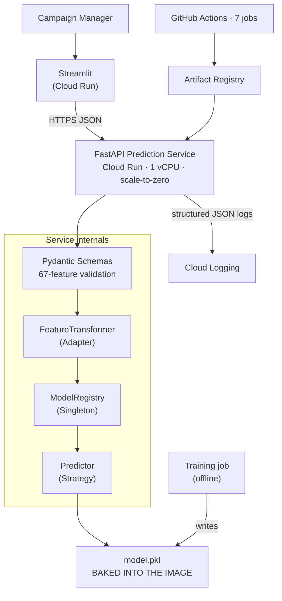
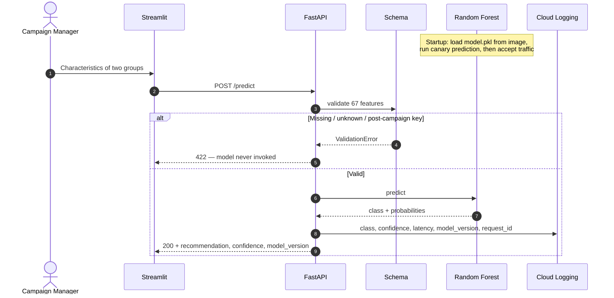
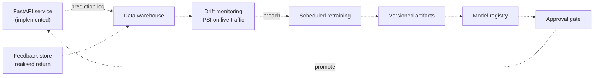

# Predicting Profitable Customer Groups

### End-to-end machine learning and MLOps solution

| | |
|---|---|
| **Candidate** | Venkata Nagendra Reddy Suda |
| **Role** | Machine Learning / MLOps Engineer |
| **Submitted to** | PAYBACK — Loyalty Partner GmbH |
| **Exercise** | Direct-marketing campaign targeting for an online marketplace |
| **Date** | 18 August 2026 |

**Confidentiality.** Work performed on a confidential dataset supplied for a recruitment exercise.
The dataset is not reproduced or attached, and no row-level data appears in this document or the
accompanying archive.

**Live service.** API and Streamlit frontend deployed on Google Cloud Run, verified 18 August 2026.

<div style="page-break-after: always;"></div>

## 1. Answers to the brief

### ML 1 — Campaign outcomes

| Outcome | Campaigns | Share |
|---|---|---|
| **Group 1 more profitable** | 3,076 | **46.47%** |
| **Group 2 more profitable** | 1,877 | **28.35%** |
| **Neither profitable** | 1,667 | **25.18%** |

*Counted directly from the outcome label across all 6,620 campaigns.*

> **Figure 1** — `reports/figures/01_campaign_outcomes.png`

**A quarter of campaigns should not have run.** That is the largest avoidable cost in the data, and
— as §4 shows — the case the model handles worst.

### ML 2 — The predictive model

Random Forest inside a scikit-learn pipeline. Input: the 67 attributes available *before* a
campaign launches. Output: *target Group 1*, *target Group 2*, or *do not run*, with class
probabilities and a confidence.

Selected from seven candidates across four model families by mean five-fold cross-validated
accuracy, on development data only. Three variables recorded *after* a campaign concludes are
excluded (§2).

### ML 3 — Estimated improvement, and how to validate it

| | Campaign success rate |
|---|---|
| **Model** | **54.83%** |
| Always target Group 1 (best naive rule) | 46.45% |
| Always target Group 2 | 28.40% |
| Random choice | 37.42% |

> ### Estimated improvement: **+8.38 percentage points**
> 95% paired-bootstrap CI **[+5.66, +11.18]** · relative **+18.05%** · excludes zero

**Validation** — a prospective randomised experiment (§8). Campaign-level randomisation, model
recommendation against the current process, realised ROI as the primary metric, guardrails on
revenue and contact volume, pre-registered analysis.

> **This measures decisions, not euros.** Accuracy weights every campaign equally; money does not.
> Confirming financial impact needs spend and margin figures the dataset does not contain, plus
> the experiment above.

### Engineering 1 and 2

| Deliverable | Status | Section |
|---|---|---|
| High-level architecture diagram | Implemented components only | §5 |
| Sequence diagram | Full request path incl. failure branch | §5.2 |
| Backend prediction APIs | FastAPI, single + batch, deployed and verified | §6, §7.3 |
| Object-oriented design | Strategy, Factory, Adapter, Registry, App Factory, DI | §6.2 |
| Testing setup | 427 tests, 17 modules, 91.43% branch coverage | §7 |
| Clean code, design patterns | ruff, black, mypy enforced in CI | §7 |
| *Beyond the brief* | Streamlit UI, Terraform, 7-job CI, drift reference, decision layer | §5–7 |

<div style="page-break-after: always;"></div>

## 2. Data and the leakage decision

**6,620 campaigns · 67 permitted features · 3 excluded**

| Block | Columns | Available before campaign? |
|---|---|---|
| `g1_1` … `g1_20` | 20 | Yes — Group 1 characteristics |
| `g2_1` … `g2_20` | 20 | Yes — Group 2 characteristics |
| `c_1` … `c_27` | 27 | Yes — pre-computed comparisons |
| `g1_21`, `g2_21`, `c_28` | 3 | **No — recorded after the campaign** |

### Why the three columns are excluded

The obvious reason would be that they leak the answer. **They don't** — and that is the more
interesting finding.

| Test | Result | Implication |
|---|---|---|
| Correlation with outcome | −0.048, −0.002, +0.021 | No individual signal |
| Model fitted with vs without | macro F1 0.4907 vs 0.4869 | Gap 0.0038 — inside fold noise (σ ≈ 0.012) |

A correlation-based screen would have kept all three. They are excluded on **availability**: at the
moment a campaign manager asks for a recommendation, these values do not exist. A model needing
them cannot be served.

Enforced in three places — training split, feature adapter, HTTP schema — with tests that fail if
any layer lets one through.

### Data limitations

| Limitation | Consequence |
|---|---|
| Features anonymised | Importances are predictive, not causal |
| No campaign/customer ID | Row independence unverifiable; intervals may be optimistic |
| No time column | Generalisation to *future* campaigns untested (tested for explicitly — none found) |
| 15 of 27 `c_` features reconstructible from group blocks | Engineered difference/ratio features add ~0.0003 accuracy |

> **Figure 2** — `reports/figures/02_distributions.png` — feature distributions; skew, zero-spikes
> and differing scales motivate tree models over linear ones.

<div style="page-break-after: always;"></div>

## 3. Method

| Step | Decision | Rationale |
|---|---|---|
| 1 | Test for hidden time ordering | None found → stratified random split is honest |
| 2 | 80/20 split, seed 20260819 | 5,296 development / 1,324 holdout |
| 3 | Reserve 1,060 for calibration | Thresholds selectable without touching holdout |
| 4 | 5-fold CV on development only | 4,236 training rows |
| 5 | Select on **accuracy** | It *is* the campaign success rate the brief asks to improve |
| 6 | Freeze pipeline, evaluate holdout **once** | |

Preprocessing sits inside the pipeline, so transformations fit on training folds only and identical
code runs at training and serving — training/serving skew is eliminated by construction.

**Why not macro F1?** It was tried as the selection metric and rejected on evidence: it chose a
better-balanced model whose success rate fell *below* the always-Group-1 baseline.

### Candidate comparison

| Model | CV accuracy | Std | CV macro F1 |
|---|---|---|---|
| **Random forest** | **0.5781** | 0.0051 | 0.4854 |
| XGBoost | 0.5741 | 0.0090 | 0.4941 |
| CatBoost | 0.5656 | 0.0088 | 0.5166 |
| HistGradientBoosting | 0.5649 | 0.0067 | 0.4910 |
| MLP | 0.5626 | 0.0183 | 0.4654 |
| LightGBM | 0.5590 | 0.0124 | 0.4962 |
| Logistic regression | 0.5229 | 0.0181 | 0.5023 |

### The champion is a rule, not a judgement

Random Forest leads by **0.40 points**. Three checks say that margin is not a separation:

| Check | Result |
|---|---|
| Nested cross-validation | Ranks XGBoost **above** Random Forest (0.5899 vs 0.5816) |
| Two hyperparameter searches, identical folds | Selected **different** winners |
| Changing only the split seed | Moves holdout accuracy **2.72 points** (SE = 1.37) |

> **The candidates differ by 0.40 points. The measuring instrument moves by 2.72.**

The defensible claim is not that Random Forest is best. It is that the rule was fixed in advance,
applied without override, and executed before the holdout was opened. This is also why no further
tuning was done — below the noise floor, search optimises noise.

**Calibration was evaluated and rejected.** Isotonic reduced calibration error by 6.1% against a
pre-stated 10% threshold. The shipped model is uncalibrated.

<div style="page-break-after: always;"></div>

## 4. Results

| Metric | Result |
|---|---|
| **Accuracy (campaign success rate)** | **54.83%** |
| Always-Group-1 baseline | 46.45% |
| **Lift** | **+8.38 pp**, CI [+5.66, +11.18] |
| Macro F1 | 44.82% |
| Balanced accuracy | 47.80% |
| Log loss / ECE | 0.9538 / 0.0213 |
| Wasted campaigns avoided | 28 of 333 |

### Where it succeeds and fails

| Actual ↓ / Predicted → | Neither | Group 1 | Group 2 | **Recall** |
|---|---|---|---|---|
| **Neither profitable** | **28** | 184 | 121 | **8.4%** |
| **Group 1 best** | 36 | **490** | 89 | 79.7% |
| **Group 2 best** | 45 | 123 | **208** | 55.3% |

> **Figure 3** — `reports/figures/04_confusion_matrix.png`

**The aggregate hides an uneven profile.** Strong on Group 1, moderate on Group 2, weak on
"neither" — correctly declining only 28 of 333.

This matters commercially because the errors cost differently. Choosing the wrong profitable group
*redirects* spend; failing to decline an unprofitable campaign *wastes* it. The model is better at
the cheaper decision. Fixing this needs cost data the dataset does not contain.

### A confident subset performs materially better

| Confidence ≥ 0.60 | Coverage | Accuracy on covered | Always-Group-1, same rows |
|---|---|---|---|
| Calibration set — where the threshold was chosen | 33.2% | 73.9% | — |
| **Holdout — threshold applied unchanged** | **34.8%** (461/1,324) | **71.6%** | **57.5%** |

The rule was stated in advance — highest covered accuracy subject to at least 30% coverage — and
selected on calibration data, never on the holdout.

The 2.28-point difference between the two sets **may reflect ordinary sampling variation,
threshold-selection optimism, or both.** A single comparison cannot separate them. Both figures are
shown because reporting only the calibration number would overstate the gate, and reporting only
the holdout number would hide that the threshold was chosen elsewhere.

**This is a selective operating point, not the model's full-coverage accuracy.** The comparison that
matters is 71.58% against 57.48% *on the same 461 campaigns* — a **+14.10 pp same-subset
difference**. Setting it against the baseline's overall 46.45% would compare an easy subset with a
full population and inflate the result.

It supports an "automate the confident third, review the rest" pattern — 461 decided, 863 escalated
— and requires operational and online validation before any automation. **Disabled by default:** the
review capacity it assumes has not been agreed with the business.

> **Figure 4** — `reports/figures/10_operating_points.png`

### What the model relies on

| Rank | Permutation importance | SHAP |
|---|---|---|
| 1 | **`c_2` (0.0647)** | **`c_2` (0.0478)** |
| 2 | `c_4` (0.0157) | `diff_1` (0.0121) |
| 3 | `g1_18` (0.0113) | `ratio_1` (0.0119) |

> **Figure 5** — `reports/figures/06_permutation_importance.png`

**One anonymised column carries more signal than the other 66 combined, and nobody knows what it
measures.** Recovering its meaning is the cheapest high-value action available — it would either
validate the primary signal or reveal a collection artefact. One conversation.

<div style="page-break-after: always;"></div>

## 5. Architecture

### 5.1 Implemented today



**The model is baked into the image.** Inference has no runtime dependency on cloud storage or a
registry, so a revision is immutable and self-contained — and rollback is a revision rollback
rather than a config change. Cost: a 47 MB layer and a slower cold start, both acceptable for
bursty traffic.

**Deliberately absent:** no Kubernetes, orchestrator, feature store, message queue or model
registry. Each adds operational surface without solving a present requirement. Seams for all of
them are identified in Appendix C.

### 5.2 Prediction sequence



<div style="page-break-after: always;"></div>

## 6. API and software design

### 6.1 Endpoints

| Endpoint | Purpose |
|---|---|
| `POST /predict` | Score one comparison |
| `POST /predict/batch` | Up to 1,000 comparisons |
| `GET /live` | Process liveness — checks nothing else |
| `GET /ready` | 200 **only** when a real trained model is loaded |
| `GET /health` | Human-readable status |
| `GET /model/info` | Feature contract, version, lineage |

**`/live` and `/ready` are separate because an orchestrator acts on them differently.** Failed
liveness means *restart*; failed readiness means *stop sending traffic*. A liveness probe that also
checked the model would crash-loop a container whose only problem is a missing artifact. Serving
the fallback baseline counts as *not ready* — a 46%-accurate rule should be drained, not given
traffic.

### 6.2 Design patterns

| Pattern | Implementation | Removes this future edit |
|---|---|---|
| Strategy | `BasePredictor` | Swapping model family touches one class |
| Factory | `ModelFactory` | Construction logic in one place |
| Adapter | Payload → DataFrame | Payload shape change touches one adapter |
| Registry (singleton) | `ModelRegistry` | Artifact deserialised once, not per request |
| Dependency injection | FastAPI `Depends` | Tests need no model file |
| Application factory | `create_app()` | Isolated app per test |
| Pipeline | Preprocessing + estimator | Training/serving skew impossible |

### 6.3 Response and input safety

```json
{ "predicted_class": 2, "label": "group_2",
  "description": "Group 2 was the most profitable",
  "recommended_action": "Target customer group 2",
  "confidence": 0.61,
  "probabilities": { "no_group_profitable": 0.12, "group_1": 0.27, "group_2": 0.61 },
  "model_version": "1.0.0" }
```

`model_version` is on the prediction itself, not only `/model/info` — reconciling a logged decision
later needs to know which model made it. Every response carries `X-Request-ID`, echoed from the
caller when supplied.

| Condition | Response |
|---|---|
| Missing / unknown / misspelled feature | 422, field named |
| Post-campaign variable supplied | 422 |
| NaN or infinity | 422 — distinguished from a legitimate `null` |
| >20% of features null | 422 — prediction would describe the imputer |
| Batch > 1,000 rows · body > 8 MB | 422 · 413, before scoring/parsing |
| Model unavailable | `/ready` 503, no silent fallback |
| Unhandled error | Sanitised 500 + request ID, no traceback to caller |

<div style="page-break-after: always;"></div>

## 7. Testing, CI, security and deployment

| Check | Result |
|---|---|
| Test suite | **427 passed**, 17 modules |
| Branch coverage | **91.43%** (enforced floor 90%) |
| ruff / black / mypy | Pass / Pass / Pass, 27 files |
| Bandit | No findings, 5,590 lines |
| pip-audit (serving deps) | No known vulnerabilities |
| Terraform | fmt, init, validate pass |

Synthetic fixtures throughout — the dataset is confidential and never committed, so CI has no data
to train on. That constraint is what makes the code verifiable by a machine not permitted to see
the data.

### 7.1 CI — seven jobs

| Job | Checks |
|---|---|
| `data-guard` | No dataset in the tree **or in git history**; release archive builds clean |
| `lint` | ruff, black, mypy |
| `test` | pytest + coverage gate |
| `terraform` | fmt, backend-less init, validate |
| `security` | pip-audit (release-blocking), Bandit |
| `docker` | Image builds, container boots, `/health` responds |
| `docker-with-model` | Synthetic artifact baked in; asserts `/ready` → 200, real prediction, non-root user |

The data guard runs **two** checks: one asks whether a dataset is in the tree now, the other walks
every commit on every branch. Deleting a file later does not remove it from earlier commits, and a
clone still carries it.

### 7.2 Deployment

| Setting | Value | | Latency (50 req, 0 failures) | ms |
|---|---|---|---|---|
| Region | `europe-west3` | | Median | 79.0 |
| CPU / concurrency | 1 vCPU / 8 | | **p95** | **115.8** |
| Min instances | 0 (scale to zero) | | p99 | 182.3 |
| Timeout | 60 s | | First request (warm) | 935.7 |

Concurrency and model parallelism were chosen **together**: Cloud Run defaults to 80 concurrent
requests, which suits an I/O-bound service. This one is CPU-bound — a 400-tree forest on one vCPU —
so concurrency is 8 and the estimator is pinned at `n_jobs=1`. `n_jobs` is pickled with the
estimator, making it a serving decision taken at training time.

Cold start is reported with a caveat, not a number: observed once at ~15 s on a genuinely cold
container, not reproducible on demand.

### 7.3 Verified live · 18 August 2026

| Check | Result |
|---|---|
| `/live` · `/ready` · `/health` | 200 · 200 `{"ready":true}` · `model_loaded: true` |
| `/model/info` | `random_forest`, v1.0.0, `is_baseline: false` |
| `POST /predict` | 200 with class, probabilities, confidence, `model_version` |
| Lineage | `holdout_seed: 20260819`, sklearn 1.9.0, dataset + artifact SHA-256 |
| Decision layer | `decision_policy: null` — disabled, as intended |

The dataset fingerprint reported live matches `artifacts/metrics.json` — the deployed model and
every figure in this report are the same training run.

**Fail-closed, demonstrated.** During final deployment a malformed environment variable produced an
invalid model path. The artifact failed to load; fallback was disabled; startup failed; the
container exited; the startup probe failed; **the previous revision kept serving.** With a
permissive fallback the same typo would have deployed successfully and served a 46%-accurate
constant rule while reporting healthy.

**CI is complete; CD is not.** The deployment workflow holds the full procedure — keyless auth,
explicit confirmation, fail-closed artifact check — but cannot run end to end, because the model is
deliberately not in Git and nothing fetches it. Deployment is manual from a controlled environment.
The missing piece is an artifact source, not more workflow code.

<div style="page-break-after: always;"></div>

## 8. Validating the improvement

Offline evaluation estimates improvement in historical decisions. Only a prospective experiment
confirms business impact.

| Element | Design |
|---|---|
| Randomisation unit | Campaign, stable assignment |
| Control | Existing selection process |
| Treatment | Model recommendation, initially surfaced to a reviewer |
| Primary metric | Realised return per campaign |
| Secondary | Correct-targeting rate, revenue, spend, decline rate, override rate |
| Guardrails | Total revenue, contact volume, per-segment outcomes, error rate |
| Rollout | 10% shadow → 50/50 randomised → staged promotion |
| Analysis | **Intention-to-treat** — analyse by assignment, not by whether the recommendation was followed |

**Pre-register before starting: MDE, sample size, duration, promotion threshold.** An experiment
sized after the data arrives is not an experiment. The offline lift of +8.38 pp with SE 1.38 is the
input to that calculation, but the online MDE should be set by what is *worth acting on*
commercially, not by what the offline estimate happens to be — those are different numbers and
conflating them is how underpowered tests get run.

Intention-to-treat matters here specifically because the treatment arm surfaces a recommendation to
a human who may override it. Analysing only the followed recommendations would measure the humans'
selection, not the model's.

**Feedback contract.** Log campaign ID, model version, timestamp, eligible actions, selected action,
probability vector, confidence, human override, and **assignment probability**. The last matters
most: without it, data collected under the policy is biased by the policy, and future models
inherit that bias.

**Promotion criteria.** Promote only if the primary metric improves at the agreed confidence with
guardrails intact. Assess class-0 separately — avoiding a loss may be valued differently from
picking the better group. Retain a control group after rollout to detect decay.

## 9. Limitations and next steps

| Limitation | Consequence | Mitigation |
|---|---|---|
| **Class-0 recall 8.4%** | Most unprofitable campaigns not declined | Cost data; cost-sensitive objective; human review |
| `c_2` dominates, unexplained | Primary signal unvalidated | One conversation with a data owner |
| Anonymised features | No causal reading | Data dictionary |
| No campaign/customer ID | Independence unverifiable | Add IDs, group-aware splits |
| No time column | Future generalisation untested | Chronological validation when timestamps exist |
| Group-swap inconsistency 53.8% | Model partly depends on slot assignment | First drift signal to monitor |
| Single 20% holdout, 1,060 rows unused | SE 1.37 pp vs ≈0.68 with out-of-fold refit | Adopt next iteration |
| Offline lift only | Not financial return, not causal | The A/B test |
| Cost matrix assumed | Decision layer untrustworthy | Enable once business supplies figures |
| Public unauthenticated endpoint | Evaluation only | Cloud Run IAM / IAP + frontend identity token |
| No drift alerting, retraining, registry | Maturity gaps | Add once a feedback store exists |

### Priorities

1. **Run the A/B test** with campaign IDs and feedback logging — everything else depends on it.
2. **Recover what `c_2` measures.**
3. **Obtain campaign/customer identifiers** — makes the intervals honest.
4. **Obtain cost, margin and outcome values** — turns lift into a monetary statement.
5. **Add authenticated production access.**
6. **Build the feedback store**, then drift monitoring and retraining. Not before — without realised
   outcomes there is nothing to retrain on.

### Conclusion

The submission delivers the required analysis, model, architecture, backend APIs and testing, plus
a verified live deployment whose reported lineage matches this document. The model improves the
campaign success rate by an estimated **+8.38 percentage points** over the strongest naive
baseline, with a confidence interval excluding zero.

Two things are equally true. The system is engineered to a production standard. The model is not
ready for autonomous use — class-0 recall is weak, the economic inputs needed to optimise the
decision are absent from the data, and the improvement is measured in decisions rather than euros.
Assisted deployment with human review, followed by the experiment in §8, is the responsible path.

<div style="page-break-after: always;"></div>

## Appendix A — Metrics and key decisions

| Metric | Value | | Decision | Rationale |
|---|---|---|---|---|
| Campaigns / features | 6,620 / 67 | | Exclude 3 post-campaign columns | Unavailable at prediction time |
| Split | 4,236 / 1,060 / 1,324 | | Select on accuracy | Macro F1 chose a below-baseline model |
| Holdout seed | 20260819 | | Random Forest champion | Won the pre-stated rule; margin inside noise |
| CV accuracy | 0.5781 ± 0.0051 | | Reject isotonic calibration | 6.1% gain vs 10% threshold |
| Test accuracy | 0.5483 | | Reject symmetry augmentation | Positions not exchangeable |
| Macro F1 / balanced acc. | 0.4482 / 0.4780 | | Decision layer off | Cost matrix assumed, not supplied |
| Per-class recall | 0.084 / 0.797 / 0.553 | | Bake model into image | Immutable revisions, simple rollback |
| Lift | +8.38 pp [5.66, 11.18] | | `n_jobs=1`, concurrency 8 | One vCPU — chosen together |
| Log loss / ECE | 0.9538 / 0.0213 | | Cloud Run over Kubernetes | One stateless container |
| Symmetry violation | 53.8% | | Manual deployment | Artifact not in Git |
| Drift check (max PSI) | 0.025 — no shift | | | |
| Tests / coverage | 427 / 91.43% | | | |
| Latency p95 / median | 115.8 / 79.0 ms | | | |
| Python / scikit-learn | 3.12.4 / 1.9.0 | | | |

## Appendix B — Reproduction

| Task | Command |
|---|---|
| Install | `pip install -r requirements.txt` |
| Train | `python -m src.training.train --data data/customerGroups.csv --out artifacts --calibrate --holdout-seed 20260819` |
| Verify consistency | `python scripts/check_consistency.py` |
| Test | `pytest` |
| Serve API / frontend | `uvicorn src.api.main:app --port 8000` · `streamlit run frontend/app.py` |
| Build image / release | `docker build -t campaign-group-predictor .` · `python scripts/build_release.py` |

Training flags are not optional: omitting `--holdout-seed` selects a different test set and changes
every headline figure. `check_consistency.py` derives the champion, accuracy, lift and latency from
the artifacts and fails if any document disagrees.

| Path | Contents |
|---|---|
| `notebooks/01_case_study_analysis.ipynb` | Exploratory and modelling narrative answering the brief |
| `notebooks/02_optional_diagnostics.ipynb` | Deeper diagnostics; writes `advanced_diagnostics.json` |
| `src/training/` · `src/api/` | Training and evaluation · FastAPI app, schemas, routes |
| `src/predictors.py` · `src/decision.py` · `src/symmetry.py` · `src/drift.py` | Strategies · cost policy · group-swap diagnostics · drift |
| `tests/` · `terraform/` · `.github/workflows/` | 427 tests · IaC · CI |
| `artifacts/metrics.json` | Canonical machine-readable results |

## Appendix C — Target architecture (proposed, none implemented)



Every component depends on the feedback store existing first. Without realised return per campaign
there is nothing to retrain on, nothing to compute drift against, and no basis for approval — which
is why obtaining a campaign identifier outranks any modelling work.

| Trigger | Reasonable evolution |
|---|---|
| Multiple models and approval stages | Managed registry and promotion workflow |
| Scheduled multi-step training | Vertex AI Pipelines or equivalent |
| Online feature lookups | Feature store with parity controls |
| Sustained high traffic or GPU inference | Dedicated endpoints or Kubernetes |
