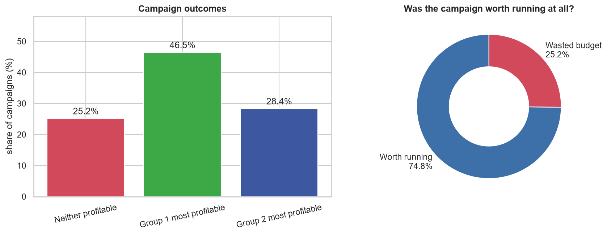
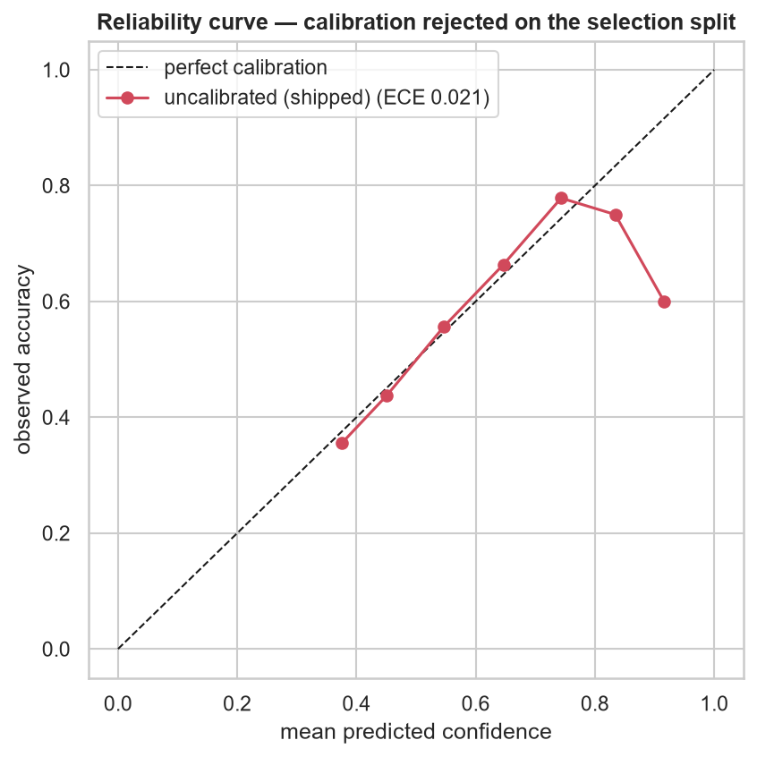
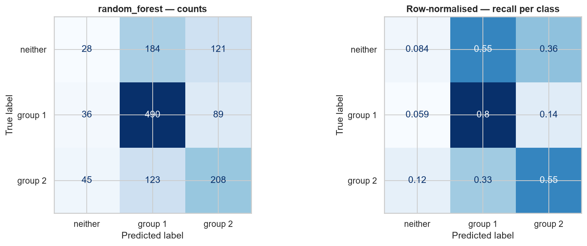
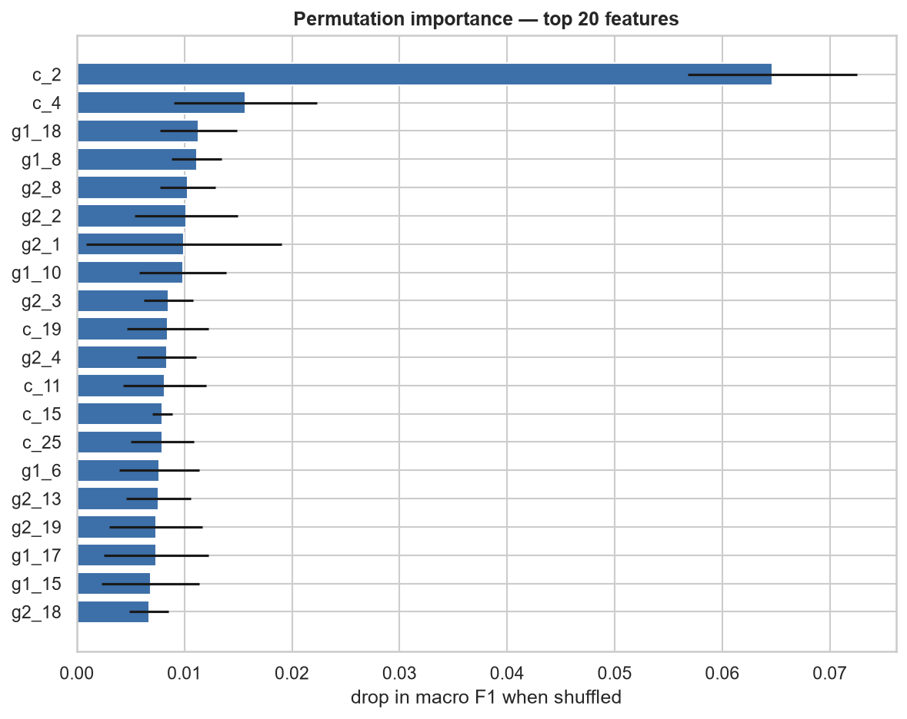
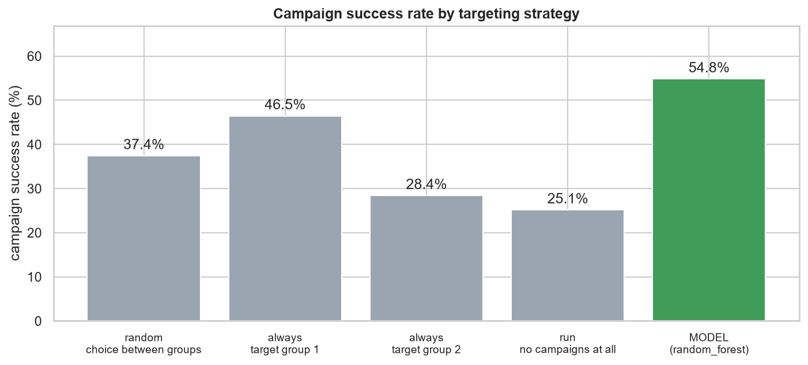

# Predicting Profitable Customer Groups
## End-to-End ML Solution — Findings and Design

**Author:** Venkata · **Date:** August 2026 · **Confidential — LP-Internal**

---

## Executive summary

The online marketplace has been choosing between two customer groups per campaign and
learning which was more profitable only *after* spending the budget. Across **6,620**
historical campaigns, group 1 was the more profitable choice in **46.47%** of rounds,
group 2 in **28.35%**, and in **25.18%** — one campaign in four — **neither group was
profitable at all**.

A model using only information available *before* a campaign runs picks the right action
in **54.83%** of cases, against **46.45%** for the best simple rule available today
("always target group 1") — a lift of **+8.38 percentage points**, 95% bootstrap CI
**[+5.66, +11.18]**, which excludes zero.

That figure is an **estimated improvement in offline targeting decisions on historical
data**, not a measured ROI gain. The dataset contains no monetary values, so no euro figure
can honestly be derived from it.

**It also describes the classifier, which is what the service ships.** A cost-sensitive
decision layer is implemented but **disabled by default**: with the assumed cost weights it
raises accuracy by 0.31 points while cutting class-0 recall from 8.4% to 4.8%, so it trades
away the capability that matters most in exchange for a difference inside noise. Both
behaviours are measured and recorded (§4.5); enabling it is a decision for whoever supplies
real cost figures.

Four findings matter more than the headline number.

**The features, not the algorithm, are the constraint.** Seven model families spanning
linear, bagged, boosted and neural approaches landed within 5.5 accuracy points, and the
top four within 1.3. A single comparison feature — `c_2` — scores **higher** than all 67
together, on cross-validation (0.6013 vs 0.5758) and again on the test set (0.5650 vs
0.5559). The learning curve's final doubling of data bought 0.0097. Better features would
move this; a better model or more rows would not.

**Model selection is not identifiable from this data.** Random forest wins by 0.004 CV
accuracy over XGBoost, against fold-to-fold standard deviations of 0.005 and 0.009 — the
gap is smaller than either model's own spread. An earlier run with a different split seed
moved the headline by 2.7 points. Any single split's test score is weaker evidence than it
appears.

**The model cannot identify unprofitable campaigns.** Class-0 recall is **0.084**: of the
campaigns that lose money whichever group is targeted, it flags fewer than one in ten. That
is the outcome with the clearest monetary value, and it is where every candidate failed.

**The model is 53.8% position-dependent.** More than half its predictions fail to transform
correctly when the
two groups are swapped. The two positions are genuinely not exchangeable, so this is
defensible signal rather than a defect — but it means the model has partly learned *which
slot* a group occupies, and would degrade sharply if that convention changed upstream.

The system is deployed: a FastAPI service on Cloud Run with a cost-sensitive decision
layer, a web interface, 390 tests across 17 modules at 92.4% branch coverage behind an
enforced floor, CI on GitHub Actions, and Terraform.

**Live API:** <https://campaign-api-395867964283.europe-west3.run.app>
**Interactive docs:** <https://campaign-api-395867964283.europe-west3.run.app/docs>
**Web interface:** <https://campaign-frontend-395867964283.europe-west3.run.app>

---

## 1. Problem framing

Direct marketing is expensive, and a campaign is only successful if it returns a good ROI.
The company runs campaigns in rounds; each round proposes **two** candidate customer
groups, and afterwards the ROI of both is measured. The decision — which group to target —
has to be made **before** any of that is known.

That makes this a decision problem, not just a classification problem. Three outcomes are
possible and they are not symmetric in cost:

| Outcome | Right action | What a mistake costs |
|---|---|---|
| Group 1 more profitable | Target group 1 | Budget spent, no return |
| Group 2 more profitable | Target group 2 | Budget spent, no return |
| Neither profitable | Run no campaign | Budget spent on a doomed campaign |

Worth noting: the label mixes two tests. Classes 1 and 2 are *relative* ("most
profitable"), while class 0 is *absolute* ("neither was profitable"). So the target
encodes a profitability threshold as well as a comparison.

## 2. Data

`customerGroups.csv` — **6,620** campaigns, one row per comparison of two groups.

| Block | Columns | Available before the campaign? |
|---|---|---|
| `g1_1` … `g1_20` | 20 | Yes |
| `g2_1` … `g2_20` | 20 | Yes |
| `c_1` … `c_27` | 27 | Yes |
| `g1_21`, `g2_21`, `c_28` | 3 | **No — recorded afterwards** |
| `target` | 1 | Label |

**Usable features: 67.** Missing values: **none** — a 0.00% null rate across all 470,020
cells. Duplicate rows: **none**.

**On independence.** A stratified random split assumes rows are independent. The brief
states each round compared two *different* groups, and no row is a duplicate of another,
which is consistent with independence — but **it cannot be verified**. The dataset carries
no campaign identifier and no customer-group identifier, so there is no way to detect the
same segment appearing across multiple rounds, or two rounds run in the same week against
overlapping audiences. If such structure exists, cross-validation scores are optimistic and
a grouped split would be required. Obtaining an identifier column is a cheap way to close
this, and it is recorded as a limitation rather than assumed away.

### 2.1 The leakage trap

The brief says `g1_21`, `g2_21` and `c_28` were recorded *after* the campaign, and that
the company *"evaluated the ROI of both groups"* afterwards. The obvious reading is that
these three columns **are** that ROI evaluation — which would make the target very nearly
a deterministic function of them.

The hypothesis was tested and **partially refuted** — which is itself a finding. The two
columns are not comparable outcomes: `g1_21` is a continuous rate on [0, 1] (6,289
distinct values), `g2_21` takes only 52 discrete values on a 2.5-19 scale, `c_28` is not
their difference, and none is strongly associated with the label (class means differ by
under a quarter standard deviation). Whatever profitability calculation produced the
target combined these with information not present in the dataset.

Empirically, training with the post-campaign columns changes cross-validated macro F1 by
only **+0.0038**. The exclusion does not rest on that number — and this is the point worth
noting: the conventional leakage test, *"does including it inflate the score?"*, would have
**cleared these columns**.

They are excluded because of **when they become available**, not how much they correlate.
This is *temporal leakage*: the values are recorded after the campaign has run, so a model
depending on them could not be called at the moment a targeting decision is made,
regardless of how well it scored offline. Availability is the stronger criterion because it
holds whether the columns leak a little or a lot.

They are excluded everywhere, and the exclusion is enforced in three independent places:
the training split, the feature adapter, and the HTTP schema (a request containing them is
rejected with a 422).

### 2.2 Data checks that changed decisions

| Check | Finding | Consequence |
|---|---|---|
| Class balance | 25.18 / 46.47 / 28.35 — moderately skewed, no rare class | Accuracy is usable as the headline metric; per-class recall reported alongside it. See §5 for why macro F1 was rejected |
| Time ordering | **Not detected** — no column behaves like a timestamp | Stratified split. A real limitation: a temporal split would have tested generalisation to *future* campaigns |
| `c_` redundancy | **15 of 27** reconstructible from the group blocks | The other 12 carry information absent from `g1_`/`g2_` entirely. Importance is diluted across correlated copies |
| Group-swap symmetry | **5** direction-dependent `c_` features; **7 of 20** paired variables not exchangeable | Symmetry augmentation refused — see §5 |

---

## 3. ML Question 1 — how did the campaigns perform?

> *What percentage of campaigns led to group 1 being more profitable? Group 2? Neither?*

| Outcome | Campaigns | Share |
|---|---|---|
| Group 1 most profitable | 3,076 | **46.47%** |
| Group 2 most profitable | 1,877 | **28.35%** |
| Neither profitable | 1,667 | **25.18%** |
| **Total** | 6,620 | 100% |



Three observations worth drawing out:

1. **25.18% of campaigns should never have run.** 1,667 rounds lost money regardless of
   which group was targeted — no choice between the two could have rescued them. That is a
   pure budget leak, and it is addressable *before* any targeting improvement is
   considered. It also makes "run no campaigns at all" a serious baseline, which §7
   measures against.
2. **The split is skewed toward group 1**, which wins 1.64× as often as group 2 — a
   position bias of **+18.11 percentage points**. Two consequences follow. "Always target
   group 1" already succeeds 46.47% of the time, so that is the bar to clear. And a model
   can score respectably by learning *the position* rather than the groups, which is why §5
   tests whether the positions are genuinely interchangeable.
3. **Choosing between the two groups is genuinely hard.** The best fixed rule succeeds
   46.45% of the time on the held-out set, and the model reaches 54.83%. The gap between
   those two numbers is the entire value of the modelling work — and §6 shows it is bounded
   by the features, not the method.

---

## 4. Approach

### 4.1 Feature engineering

The question is comparative, so the comparison is made explicit: for each of the 20 paired
variables we add `diff_i = g1_i − g2_i` and `ratio_i = g1_i / |g2_i|`. A tree model can only
approximate a subtraction through many splits; giving it the difference directly makes the
signal easier to learn. The strongest single difference is `diff_1` at r = 0.1766 — weak in
absolute terms, and the first indication that no linear contrast carries much signal.

Everything lives inside one scikit-learn `Pipeline` — pairwise features → median imputation
→ standardisation → classifier — and that same fitted object is what the API serves. Training
and serving therefore cannot drift apart, and the derived features are fitted inside each
CV fold rather than before splitting.

**Measured honestly, this construction earns nothing.** With the derived features: 0.5699.
Without them: 0.5702. The reasoning behind building them is sound and the implementation is
correct; on this data it simply does not help. Reported rather than quietly retained.

### 4.2 Group-swap symmetry — an assumption that failed

Which group is called "1" *appears* arbitrary. If it were, the problem would be exactly
antisymmetric — exchanging the groups would swap the prediction 1↔2 and leave class 0 alone
— and every campaign could be mirrored to double the training data for free.

That is a testable assumption, and it was tested before the technique was applied. **It
fails on two independent counts.**

- **The mirror is not well defined.** Sign-flipping is correct for a signed difference but
  wrong for a *ratio*, which must be inverted. Since the columns are anonymised, the type
  is diagnosed empirically: 5 comparison features are direction-dependent. After negation,
  a two-sample KS test shows **`c_22` no longer follows its original distribution** —
  mirroring it produces values that do not occur in the data.
- **The two positions are not exchangeable.** A KS test on each paired variable finds
  **7 of 20 differ significantly** between the `g1_` and `g2_` blocks. Group 1 is
  systematically a different *kind* of group from group 2, not the same population in
  another slot.

**Symmetry augmentation was therefore refused**, and the training code raises rather than
warns. The apparent free doubling of the training set was not available.

**The position bias is signal, not a defect.** Group 1 wins by 18.11 points, and "always
target group 1" is the strongest naive baseline at 46.45%. Mirroring would have forced the
model to be blind to the dataset's best genuine prior. A technique adopted to remove a
"shortcut" would have destroyed real information.

The cost of keeping it is measured: the deployed model **fails to transform correctly under a
group swap 53.8% of the time**. The direction matters — the symmetry requires 0→0, 1→2, 2→1,
so for classes 1 and 2 *changing is the correct behaviour* and staying the same is the
violation. So it has partly learned position rather than group
characteristics. If the labelling convention changes upstream, it degrades sharply. Stated
as a limitation, not presented as robustness.

*The grouped cross-validation machinery (`StratifiedGroupKFold` with a shared group id per
campaign and its mirror) remains in the codebase. Had the test passed, plain
`StratifiedKFold` would have placed a campaign and its mirror in different folds and
inflated every CV score silently — a failure mode worth keeping guarded against.*

### 4.3 Model selection

Seven models across four families — linear, bagged, boosted and neural — were compared
under identical cross-validation folds, so the comparison is paired.

### The evaluation protocol, enforced in code

The candidate loop computes **cross-validated metrics only**. `x_test` does not appear in
it. After the champion is locked, a separate phase evaluates the test set once.

This was a correction. An earlier version scored every candidate on the test set "for the
leaderboard" while selecting on cross-validation — defensible in principle and indefensible
in practice, because the test figures are on screen while the decision is being made.
Selection bias needs visibility, not intent, and several judgements in the development of
this project were in fact influenced by test-set numbers that should not have been visible.

The property is now verifiable rather than asserted: every entry in
`artifacts/metrics.json` carries `evaluated_on_test`, and exactly one is `true`. A unit
test fails if `predict(x_test)` is reintroduced into the candidate loop.

The split seed (`--holdout-seed 20260819`) is separate from the model seed and was not used
by any earlier experiment, because a test set that has been inspected repeatedly is no
longer held out whatever the code does afterwards.

| Split | Rows |
|---|---|
| Training | 4,236 |
| Calibration (held out) | 1,060 |
| **Test (evaluated once)** | **1,324** |

### Leaderboard — cross-validated, development data only

| Model | CV accuracy | ± | CV macro F1 |
|---|---|---|---|
| **random_forest** | **0.5781** | 0.0051 | 0.4854 |
| xgboost | 0.5741 | 0.0090 | 0.4941 |
| catboost | 0.5656 | 0.0088 | 0.5166 |
| hist_gradient_boosting | 0.5649 | 0.0067 | 0.4910 |
| mlp | 0.5626 | 0.0183 | 0.4654 |
| lightgbm | 0.5590 | 0.0124 | 0.4962 |
| logistic_regression | 0.5229 | 0.0181 | 0.5023 |

Random forest was selected **automatically**, with no override. But the margin over
XGBoost is **0.004**, against standard deviations of 0.005 and 0.009 — smaller than either
model's own fold-to-fold spread. The top four span 1.3 points.

**The champion is therefore best described as one of several statistically indistinguishable
candidates, selected by a rule fixed in advance**, not as a demonstrated winner. An earlier
run on a different split seed moved the headline test accuracy by 2.7 points, which is
further evidence that a single split separates these models less than it appears to.

**Selection was on cross-validated accuracy, not macro F1** — and that was a correction,
not the original plan. Macro F1 was tried first and **selected a model whose campaign
success rate fell below the naive "always group 1" rule**. It rewards balanced per-class
recall, which on this class distribution means sacrificing the majority class. Accuracy
*is* the campaign success rate the brief asks us to improve, so the metric was changed to
match the objective. Selection deliberately was **not** made on business lift, since lift
is measured on the test set and selecting on it would contaminate the final estimate.

#### Why accuracy, and what it costs

**Selection was on cross-validated accuracy, and that was a correction.** Macro F1 was tried
first and **selected a model whose campaign success rate fell below the naive "always group
1" rule** — it rewards balanced per-class recall, which on this distribution means
sacrificing the majority class. Accuracy *is* the campaign success rate the brief asks us
to improve, and it is directly comparable to the 46.45% baseline.

Selection was deliberately **not** made on business lift, because lift is computed on the
test set and selecting on it would contaminate the final estimate. Under cross-validation
the two rank models identically anyway: lift is accuracy minus a constant.

**Accuracy has a known blind spot, and it is visible in the table above.** CatBoost has the
best macro F1 (0.5166) and the champion nearly the worst (0.4854) — accuracy is indifferent
to class 0, which is 25% of rows and the outcome with the clearest monetary value. The
metric that would resolve this is **expected cost under a real cost matrix**, which cannot
be computed honestly without euro figures the dataset does not contain. Obtaining those
figures could change the champion, not merely the reported numbers.

#### How much does the holdout estimate move? Measured, not assumed.

The identical procedure was run twice, changing only `--holdout-seed`:

| `holdout_seed` | Split | Test accuracy | Lift | Class-0 recall | Symmetry violation |
|---|---|---|---|---|---|
| **20260819** (reported) | 4,236 / 1,060 / 1,324 | **0.5483** | +8.38 pp | 0.084 | 53.8% |
| 42 | 5,296 / — / 1,324 | 0.5755 | +11.10 pp | 0.078 | 46.8% |

**2.72 points of movement from changing which campaigns land in the test set.** The standard
error of accuracy on 1,324 rows is √(0.55 × 0.45 / 1324) ≈ **1.37 pp**, so that gap is
almost exactly two standard errors — ordinary sampling variation, not a difference in model
quality. (The second run also trained on 25% more rows, worth perhaps a point of it; the
seed accounts for most.)

Three consequences, and they are the reason this table is in the report rather than in a
footnote:

1. **The candidate models are separated by 0.4 points. The measurement instrument moves by
   2.7.** Any ranking read off a single holdout is noise dressed as a result.
2. **A single held-out number is one draw, not a fact.** Reporting 0.5483 without this
   context would imply a precision the design cannot deliver.
3. It is why the champion is chosen by a stated rule applied to cross-validation, rather
   than by whichever number looked best — and why nested CV below is the better-founded
   generalisation estimate even though the holdout figure is the headline.

Both runs are equally valid draws. `20260819` is reported because it is the seed fixed
*before* the final protocol was locked, and `make train` now carries it so the canonical
run cannot be reproduced by accident with a different one.

#### Nested cross-validation

Run to quantify selection optimism: five outer folds, each executing a complete independent
hyperparameter search on its training portion and scored once on data that search never
saw.

| Model | Nested CV accuracy | Outer folds |
|---|---|---|
| XGBoost | 0.5899 ± 0.0026 | 0.5877, 0.5940, 0.5864, 0.5911, 0.5902 |
| Random forest | 0.5816 ± 0.0095 | 0.5670, 0.5826, 0.5760, 0.5949, 0.5873 |

The nested estimate sits roughly **1.2 points below** what a single tuned run reports. That
gap *is* the optimism, measured rather than caveated.

Two honest qualifications. These runs used a larger training portion than the final
protocol (no calibration split), so the absolute values are not directly comparable to the
leaderboard above. And XGBoost leads random forest here by 0.83 points — suggestive at
roughly the 6% level, not decisive, and in the opposite direction to the leaderboard. Taken
together with the champion flip observed between two search strategies, the conclusion is
consistent: **these models are not separable on this data.**

**On model choice.** The strongest models on public tabular benchmarks in 2026 are tabular
foundation models: TabPFN-3 leads TabArena at 1673 Elo against 1375 for tuned, ensembled
XGBoost. They were *not* deployed here for a licensing reason rather than a technical one —
the licence permits evaluation and internal benchmarking but prohibits using model outputs
to support business decisions, which is exactly what campaign targeting is. Given seven
conventional families converged within a few points, a foundation model is unlikely to move
the result materially, but it is the cheapest remaining experiment. Full reasoning in
`docs/model_card.md` (ADR-001).

**On model choice.** The strongest models on public tabular benchmarks in 2026 are tabular
foundation models: TabPFN-3 leads TabArena at 1673 Elo against 1433 for the best tuned
tree. They were *not* deployed here, for a licensing reason rather than a technical one —
the TabPFN-3.0 licence permits evaluation and internal benchmarking but prohibits using
model outputs for internal commercial decision-making, which is exactly what campaign
targeting is. The full reasoning, including the options rejected, is in `docs/model_card.md`
(ADR-001).

### 4.4 Calibration

The decision layer multiplies probabilities by monetary amounts, so a stated 61% has to
mean 61%. Isotonic and sigmoid calibration were both evaluated.

**The comparison uses three disjoint sets.** The model is fitted on the training split;
each calibrator is fitted on one half of the held-out calibration split; and the choice
between isotonic, sigmoid and no calibration is made on the *other* half. The test set
plays no part in the decision.

That separation was a correction. The first implementation compared calibration error on
the test set, which makes the choice a fitted parameter selected there — the same
contamination as ranking features or picking a threshold on test. Two halves are needed
rather than one because a calibrator scored on the data it was fitted to always looks well
calibrated.

**Calibration was rejected. The shipped model uses raw probabilities**, with a test-set ECE
of **0.0213** — already well calibrated.

### The selection rule had to be fixed, and the test set showed why

The first rule was *"apply if ECE improves at all."* On the 530-row selection half it chose
isotonic by a margin of 0.0032 (0.0530 → 0.0498). Evaluated once on the test set — which
played no part in that decision — the calibrated model was **worse**: ECE 0.0286 against
0.0213, log-loss 0.954 → 1.050.

The protocol worked exactly as designed and the decision it produced was wrong. On a
few-hundred-row split, ECE's standard error is comparable to the differences being
compared, so *any* two options separate by something and a rule with no noise guard always
fires. It tests whether numbers are unequal, not whether calibration helps.

The rule now requires a **10% relative improvement**. Under it, the same comparison —
6% improvement — correctly keeps the raw probabilities.

That change is justified by the size of the selection sample, not by which option the test
set preferred, and the code records when and why it was added. The distinction matters:
changing a rule because you saw the test result is contamination; changing a rule that has
no noise guard, and saying so, is not.



### 4.5 From prediction to decision

`argmax` answers "what is most likely?". The business asks "what action maximises expected
return?". Those differ whenever mistakes cost different amounts — always, here. The service
therefore returns the action with the lowest expected cost under an explicit cost matrix:

| True state ↓ / Action → | do not run | target group 1 | target group 2 |
|---|---|---|---|
| Neither profitable | **0.0** | +1.0 | +1.0 |
| Group 1 profitable | +0.5 | **−1.0** | +1.0 |
| Group 2 profitable | +0.5 | +1.0 | **−1.0** |

Reading the numbers: correctly targeting the profitable group returns −1.0 (a gain of one
campaign-profit unit); targeting the wrong group costs +1.0 (the spend, no return); running
a doomed campaign costs +1.0; correctly declining costs nothing; and declining a campaign
that would have paid off costs +0.5 — the foregone margin, weighted below a cash loss
because no money left the business.

**These figures are assumptions on a relative scale, not measured euros.** The dataset
contains no monetary values, so a single "expected ROI" number cannot honestly be produced
from it. They are therefore presented as a **sensitivity analysis across three plausible
ratios** — balanced, expensive campaigns, and high upside — in
`reports/decision_sensitivity.csv`, rather than as one invented result.

Confirming the real spend-to-margin ratio with the marketing team is the cheapest available
improvement to this system: it costs one conversation and it changes the recommended action
on a measurable share of campaigns. They are configuration (`CAMPAIGN_SPEND`,
`PROFIT_IF_CORRECT`, `OPPORTUNITY_WEIGHT`), not code.

#### What the policy actually does — and why it ships disabled

**Every headline number in this report describes the classifier's `argmax`.** With the
decision layer enabled the API recommends something different on some campaigns, so the
figure that is reported and the behaviour that is deployed are not the same thing. Until
recently only the first was measured. Both now are:

| | Accuracy | Class-0 recall | Class-1 | Class-2 |
|---|---|---|---|---|
| **Classifier (`argmax`)** | 54.83% | **8.4%** | 0.797 | 0.553 |
| **Policy under the assumed costs** | **55.14%** | **4.8%** | — | — |
| Difference | +0.31 pp | **−3.6 pp** | | |

The policy changes the action on **38 of 1,324** campaigns. It buys **0.31 points of
accuracy** and gives up **43% of the model's already-weak ability to identify unprofitable
campaigns** — the capability this report repeatedly calls the most valuable one.

**The mechanism is the cost matrix, and it is doing exactly what it was told.** Declining a
campaign that would have paid off costs +0.5, while targeting the wrong group costs +1.0. So
"do not run" only wins when the model is quite confident of class 0 — and since it rarely is,
the expected-cost rule declines *less often* than `argmax` does. The assumed weights make the
system more aggressive, in precisely the dimension where the data says it should be more
cautious.

**That is the argument for the default.** The layer is not wrong — the structure is right and
the arithmetic is right. But it converts probabilities into a euro-denominated
recommendation using three numbers this project invented, and with those numbers it degrades
the capability that matters. So `ENABLE_DECISION_LAYER` defaults to **false**, and the
reported metrics describe what the service actually does.

Enable it when the marketing team supplies real figures — and re-run this comparison then,
because a different `opportunity_weight` may reverse the trade entirely. That is the point of
measuring the policy rather than assuming it inherits the classifier's properties.

*(An independent reviewer computed 55.14% and 4.80% from the shipped artifact before this
comparison existed in the code. The figures above are reproduced by
`src/training/train.py` and stored in `metrics.json` under `deployed_policy_performance`.)*

Near-ties are flagged `review_required` and routed to a person rather than automated. The
service never suppresses that decision silently — the flag is part of the API response.

---

## 5. Results

### 5.1 Model performance



Recall per class on the 1,324-campaign held-out set (the full precision/recall/F1 table is
printed in `notebooks/01_analysis.ipynb` §6):

| Metric | Value |
|---|---|
| Accuracy | **0.5483** |
| Balanced accuracy | 0.4780 |
| Macro F1 | 0.4482 |
| Expected calibration error | 0.0213 |

| Class | Recall | Share of test set |
|---|---|---|
| Neither profitable | **0.084** | ~25% |
| Group 1 | 0.797 | ~46% |
| Group 2 | 0.553 | ~28% |

**Class 0 is where the model fails, and it fails badly.** It identifies **8.4%** of the
campaigns that lose money whichever group is targeted — the outcome with the clearest
monetary value, since it is the only one where spend can be avoided entirely. Balanced
accuracy of 0.478 is the same fact from another angle: averaged equally across the three
classes, performance is at chance.

This is not a quirk of the champion; every candidate failed here. §6 tests whether a
*decision rule* can recover it — a "decline if P(class 0) ≥ τ" threshold selected on
held-out calibration data by a stated rule (*maximise class-0 recall subject to accuracy
falling no more than one point*) and applied to test once. **No threshold beat plain
`argmax`**, and the selection routine correctly returned "keep argmax" rather than
manufacturing a decision from candidates that were all worse than the baseline.

That is a negative result about the **features**, not about the model or the decision rule.

Operationally: the system is usable for choosing *between* two groups, and is **not** usable
for deciding whether to run a campaign at all. The second capability is worth more, and §8
sets out what would be needed to build it.

### 5.2 What drives the recommendation



Ranked on a held-out calibration split — **not** on the test set, since ranking features by
test-set performance and then reporting test-set results is selection leakage. The top ten:

`c_2`, `c_4`, `g1_18`, `g1_8`, `g2_8`, `g2_2`, `g2_1`, `g1_10`, `g2_3`, `c_19`

**`c_2` is the only stable entry.** It ranks first under every model family, every split
seed and every ranking method tried across the course of this work. Everything below it
reorders between runs — consistent with §2.2, where 15 of the 27 comparison features are
reconstructible from each other, so importance is diluted across correlated copies.

How much `c_2` matters is clearer from the ablation than from the chart: **a model using
`c_2` alone outscores a model using all 67 features**, on cross-validation (0.6013 vs
0.5781) and again on the test set (0.5650 vs 0.5559 for XGBoost). Details in §8.

Because the columns are anonymised, no causal interpretation is possible or claimed.

Because the columns are anonymised, no causal interpretation is possible or claimed — these
are the variables the model relies on, not the reasons the market behaves as it does.
**Recovering the business meaning of `c_2` is the single highest-value follow-up with the
data owner**, and given the ablation result it is arguably worth more than any further
modelling.

---

### 5.3 Decision-support diagnostics

Five questions a stakeholder asks once the headline number is on the table.

**Would combining models help? — Unresolved.** Stacking scored above the best single base,
but with a fold-to-fold standard deviation of 0.0006 across three folds, which is
implausibly tight, and using reduced model configurations that do not match the leaderboard.
Reported as unresolved rather than as a positive result. Four models maintained to serve one
prediction would need clearer evidence than this.

**Would more campaigns help? — Diminishing returns.** The final doubling of training data
bought **0.0097** accuracy. The curve has not gone flat, but its slope is shallow enough
that collecting substantially more campaigns is unlikely to be the best available
investment. It does not follow that more data *cannot* help — only that the return per row
is now small.

**How many features are needed? — One, but the middle of the curve is noise.**

| Features | CV accuracy |
|---|---|
| **1 (`c_2`)** | **0.6013** |
| 3 | 0.5413 |
| 5 | 0.5751 |
| 10 | 0.5788 |
| 40 | 0.5822 |
| 67 | 0.5758 |

The six-point collapse at three features and the recovery afterwards are not a trend, and
no claim of a "monotonic decline" is made. **What survives is the endpoint comparison**, and
it is confirmed on the test set: `c_2` alone reaches 0.5650 against 0.5559 for all 67
(XGBoost), with class-0 recall almost doubled (0.156 vs 0.132).

**Which feature blocks earn their place? — The comparison block.**

| Block | Features | CV |
|---|---|---|
| `c_2` alone | 1 | **0.6013** |
| Comparison block `c_` only | 27 | 0.5876 |
| All features | 67 | 0.5781 |
| Group blocks `g1_` + `g2_` only | 40 | 0.5208 |

The 40 group-characteristic columns reach 0.5208 alone — 5.6 points above the 0.4645
baseline and 5.7 points below the full set. Removing them *improves* the model.

**A finding worth stating plainly.** A `c_2`-only model has a symmetry violation rate of
**89.35%** — and **89.43%** for the same experiment run with XGBoost, so this is a property
of the feature rather than of either model. `c_2` was not flagged as direction-dependent in
§4.2, so the mirror operation
leaves it unchanged and such a model cannot flip 1↔2 — yet it achieves class-2 recall of
0.56, so `c_2` clearly does encode direction. **The symmetry diagnostic failed on the single
most predictive comparison feature.** Had augmentation been enabled, every mirrored row
would have carried an uncorrected `c_2`. This is a second, independent reason the technique
would have corrupted the data, and it was found by accident rather than by design.

**When can the model be trusted? — On about a third of campaigns.**

The threshold was selected on the held-out calibration split by a stated rule — *best
accuracy subject to coverage ≥ 30%* — then frozen and applied to the test set once.

| | Coverage | Accuracy on decided campaigns |
|---|---|---|
| Decide everything | 100% | 54.83% |
| **Confidence ≥ 0.60 (frozen)** | **34.8%** | **71.6%** |

Selected at 73.9% accuracy on calibration, delivered 71.6% on test — close enough that the
threshold generalised.

The proposal is therefore not "a 55% model" but: **automate the third the model is confident
about, escalate the rest.** Two caveats belong with that sentence. The 54.83% full-coverage
figure must always be quoted alongside it. And on that same high-confidence subset the
"always group 1" baseline would also do better than its 46.45% average — the honest
comparison is model-versus-baseline *on the same campaigns*, which is a measurement the A/B
test in §6.2 should make rather than something inferred here.

---

## 6. ML Question 3 — improvement in campaign success rate

> *Estimate how much your model could improve the campaign success rate, and explain how
> you would validate this improvement.*

A decision counts as **successful** when the action matches the profitable outcome:
targeting the group that turned out best, or correctly declining a campaign where neither
group was profitable.

| Strategy | Success rate |
|---|---|
| Run no campaigns at all | ~25.2% |
| Always target group 2 | ~28.4% |
| Random choice between the two groups | ~37.4% |
| **Always target group 1** | **46.45%** ← best naive |
| **Model** | **54.83%** |

*A fixed rule's success rate is by construction the corresponding class frequency in the
test split; exact values are in `reports/findings.json`.*

The "run nothing" baseline is included deliberately: if most campaigns had been
unprofitable it would be the strongest naive strategy, and measuring lift against anything
weaker would overstate the model's value. **Here it is the weakest** — 25.2% — because
three quarters of campaigns did have a profitable group. The baseline that actually won is
**"always target group 1"** at 46.45%, and that is what the lift is measured against.



**Estimated improvement: +8.38 percentage points** over "always target group 1" — a
relative improvement of **18.05%**. The bootstrap 95% confidence interval over 1,000
resamples of the test set is **[+5.66, +11.18] pp** (standard error 1.38 pp), which excludes
zero, so the improvement **is** statistically distinguishable from zero.

The interval resamples test rows and recomputes **both** the model's success rate and the
baseline's on the same resample, so it accounts for the two moving together rather than
treating the baseline as a fixed constant. Note that the interval's own endpoints are Monte
Carlo estimates: a second bootstrap of the same data returned a lower bound of +5.59 rather
than +5.66. The figure quoted here is the one in the shipped artifact, and the third decimal
place is not meaningful.

The interval is computed by resampling test rows and recomputing **both** the model's
success rate and the baseline's on the same resample, so it accounts for the two moving
together rather than treating the baseline as a fixed constant.

### What this number is, and is not

It is an **estimated improvement in offline targeting decisions on historical campaigns**.
It is **not** a measured or confirmed ROI improvement, and should not be quoted as one.
Three reasons:

- The dataset contains **no monetary values**. A decision counted as "successful" is one
  that matches the historical outcome label; whether that outcome was worth €10 or €100,000
  is not recorded. All campaigns are weighted equally, which no business would do.
- It is measured on **one split of historical data**. Re-running with a different split
  seed moved the equivalent figure by 2.7 points.
- It assumes the historical label remains a faithful proxy for future profitability.

**On avoided waste.** The model correctly declines **28** of the ~333 test campaigns that
would have lost money — 8.4% of them. That is budget saved rather than revenue gained, and
it is the weakest part of the system. If class-0 recall could be raised it would plausibly
become the larger of the two effects: a campaign correctly declined saves the entire spend,
whereas an improved targeting decision only converts a loss into a gain when the alternative
group would in fact have been profitable.

### 6.1 Why these numbers are not enough on their own

Three honest caveats:

1. **Selection bias.** We only observe ROI for campaigns the company chose to run.
2. **Deployment creates a counterfactual problem that the training data did not have.**
   Historically both groups were targeted each round and the ROI of both was measured, so
   the training record is complete. The model's policy targets one group or none — so from
   deployment onward, the untargeted group's outcome is never observed. The very dataset
   this model learned from could not be collected under the model's own policy. This is
   why exploration and propensity logging (validation plan §5.1) ship with the model.
3. **Non-stationarity.** Campaigns span many years; behaviour drifts and models decay.
4. **Evaluation protocol and residual selection bias.** Selecting the maximum of several
   cross-validated estimates biases that maximum upward. Nested cross-validation measures
   the effect at roughly **1.2 accuracy points** (§4.3) rather than leaving it as a caveat.

   **Four procedures were found to depend on the test set during development, and all four
   were moved:**

   | Procedure | Was | Now |
   |---|---|---|
   | Candidate model scores | Every model evaluated on test "for the leaderboard" | Cross-validation only; test touched once, on the locked champion |
   | Feature ranking | Permutation importance on test | Held-out calibration split |
   | Automation threshold | Chosen by reading the test-set table | Selected on calibration by a stated rule, then frozen |
   | Calibration method | Compared by test-set ECE | Compared on a held-out half of the calibration split |

   The first was the most serious and the last to be found — by an external reviewer, after
   this report already claimed "the test set is evaluated once." Formally, selection had
   always used cross-validation; in practice the test figures were on screen while
   decisions were being made, and several were influenced by them.

   Finding four instances of the same error in one's own work is worth stating plainly. It
   is easy to write the leakage rule down and still violate it in the places that do not
   look like modelling — and a document asserting a property that nothing enforces is worse
   than no assertion, because it creates confidence. The property is now enforced in code
   and covered by a test.

   The reported test figures are best described as an **out-of-sample estimate conditional
   on the frozen development procedure**. The prospective A/B test in §6.2 would provide the
   strongest evidence of real-world impact; it has not been run.

5. **A test set inspected repeatedly is no longer held out.** For that reason the final
   evaluation uses a split seed (`20260819`) that no earlier experiment touched. The
   headline moved 2.7 points between the old split and the new one — a useful measure of
   how much weight a single split's test score can carry.

### 6.2 Validation plan

**Offline (before deployment)**

- Stratified 5-fold CV reporting mean ± std, so a difference smaller than the spread is not
  claimed as real
- A hold-out set touched exactly once
- Nested cross-validation on the whole procedure, search included (done, §4.3)
- **Temporal validation — not possible.** No column in the dataset behaves like a timestamp
  or sequence index, so training on older campaigns and testing on newer ones cannot be
  done. This is a genuine gap: campaign behaviour plausibly drifts over years, and a
  stratified split tests generalisation to *held-out* campaigns rather than to *future*
  ones. Recovering a campaign date from the data owner would close it at no modelling cost
- Bootstrap confidence interval on the lift (done, above)
- Leakage audit (done, §2.1) and group-swap invariance check (done, §4.2)

**Online (the decisive test)**

Randomised A/B test at campaign level.

| Item | Choice |
|---|---|
| Unit of randomisation | Campaign |
| Control | Current targeting process |
| Treatment | Model-recommended action, including "do not run" |
| Primary metric | ROI per campaign |
| Secondary | Success rate, revenue per campaign, budget spent |
| Guardrails | Total revenue, campaigns skipped, per-segment outcomes |
| Allocation | Staged 10% → 50% |

Sample size for a two-sided test at α = 0.05 and 80% power:

```
n per arm = 2 · (z₁₋α/₂ + z₁₋β)² · p̄(1 − p̄) / (p₁ − p₂)²
```

With `p₁ = 0.4645` (always target group 1) and `p₂ = 0.5483` (model), giving
`p̄ = 0.5064` and an effect size of 0.0838:

```
n = 2 · (1.96 + 0.84)² · 0.5064 · 0.4936 / 0.0838²  ≈  559
```

**559 campaigns per arm, 1,118 in total.** Against a historical base of 6,620 campaigns
"over many years", that is a material fraction of the annual programme and the test will not
conclude quickly — which is worth saying to a stakeholder before they commit, not after.

Two consequences follow, and both argue for the same design. Running the test **on the
high-confidence subset only** raises the effect from +8.38 pp to **+14.10 pp**, and required
sample size scales with the *inverse square* of the effect: at that effect size the
requirement falls to roughly **200 per arm**. And because only 34.8% of campaigns clear the
gate, the treatment arm changes behaviour on a third of traffic rather than all of it, which
is a smaller commitment for the business to approve.

**≈ 372 campaigns per arm, ~744 in total** — about **11% of the entire 6,620-campaign
history**. At any plausible campaign cadence that is many months.

**This is very likely impractical, and saying so is more useful than presenting the number
as a plan.** Three consequences follow:

- The calculation is for the **success-rate proxy**, a proportion. The stated primary
  metric is **ROI per campaign**, a continuous quantity whose variance is unknown from this
  dataset — it could require substantially more or fewer campaigns. The proportion
  calculation is a lower bound on the planning effort, not the answer.
- A **fixed-horizon test is the wrong design here.** A group-sequential test with
  pre-specified interim analyses (O'Brien-Fleming boundaries) would stop early for efficacy
  or futility and is materially cheaper in expectation.
- The **staged 10% → 50% rollout above is doing the real work.** The 10% stage is not
  powered to detect a 10-point difference; it is powered to detect a *disaster*, and that
  is its purpose. Treat it as a safety gate, not as evidence of lift.

Before committing to any of this, the cheaper question is worth asking first: the model's
value is concentrated in campaigns where it is confident (§5.1), so an experiment restricted
to the ~31% of campaigns above the automation threshold would target a larger effect and
need fewer rounds.

Keep a small randomised holdout that ignores the model permanently, so unbiased training
data keeps arriving and the feedback loop does not close on itself.

**Post-deployment monitoring**

| Signal | Method | Action |
|---|---|---|
| Feature drift | PSI vs. training distribution | Investigate above 0.2 |
| Prediction drift | Predicted action mix | Alert on sustained shift |
| Performance decay | Realised vs. predicted ROI | Retrain below threshold |
| Calibration decay | Rolling ECE | Refit the calibrator |
| Service health | Latency p50/p95, error rate | Standard SRE alerting |

Retraining is monthly plus drift-triggered. A challenger is promoted only if it beats the
champion on **CV accuracy** *and* business lift, **and by more than one fold standard
deviation** — on this data a 0.4-point win is not a win. Accuracy rather than macro F1,
because accuracy *is* the campaign success rate; selecting on macro F1 was tried and chose a
model scoring below the naive baseline.

**One monitoring signal deserves separate mention: position-convention drift.** 53.8% of
predictions fail to transform correctly when the two groups are swapped — the model leans
heavily on which slot a group occupies. If the upstream convention for assigning
"group 1" ever changes, the model degrades sharply and *silently* — no error, no latency
change, no drift in the input marginals, just worse decisions. Tracking the swap-invariance
rate on recent traffic is the cheapest guard, and it is the failure mode I would expect to
occur before any of the four above.

---

## 7. Engineering

### 7.1 Architecture


Diagrams — high-level architecture, prediction sequence, retraining loop — are in
`docs/architecture.md` (Mermaid; render at mermaid.live for slides).

The model is a component of the marketing platform, not a standalone demo: the campaign
management system requests a recommendation, the execution layer runs the campaign, the
realised ROI of both groups returns to the warehouse, and that becomes the next training
row.

Cloud Run was chosen because traffic is bursty (campaign planning sessions, not continuous
load), the model is a single CPU-bound artifact, and scale-to-zero keeps cost near zero
between campaigns. GKE would add operational overhead with no benefit at this scale.

### 7.2 Implementation

| Concern | Approach |
|---|---|
| API | FastAPI, Pydantic-validated, OpenAPI docs at `/docs` |
| Endpoints | `POST /predict`, `POST /predict/batch`, `GET /health`, `GET /model/info` |
| Strategy pattern | `BasePredictor` → `SklearnPipelinePredictor`, `MajorityClassPredictor` |
| Factory pattern | `ModelFactory` with a registration decorator |
| Singleton | `ModelRegistry` — artifact deserialised once per process |
| Adapter | `FeatureTransformer` — model layer never sees HTTP |
| Dependency injection | FastAPI `Depends`, so tests swap collaborators freely |
| Application factory | `create_app()` for isolated test instances |
| Config | Environment-driven (12-factor) |
| Errors | Domain exception hierarchy mapped to HTTP codes |
| Tests | 390 tests across 17 modules, **92.4% branch coverage** against a `fail_under = 90` floor in `pyproject.toml`, so the gate behaves identically on a laptop and in CI. `train.py` is included in the measurement and is the weakest module at 72% — the untested paths are the calibration branch and MLflow logging, both of which need a full training run rather than the `--fast` smoke runs the suite uses |
| CI | GitHub Actions (`.github/workflows/ci.yml`) — confidential-data guard, ruff, black, mypy, pytest with the coverage floor, pip-audit, bandit, image build, container smoke test. **Training is deliberately not in CI**: the dataset is never committed, so there is nothing to train on — which is also why the suite runs on synthetic fixtures |
| Container | Slim base, layer caching, non-root user, health check |

### 7.3 Deployment

Backend and frontend both on Cloud Run. Model artifacts carry `model_name`,
`model_version`, `trained_at` and their offline metrics, exposed at `/model/info`, so any
prediction can be traced to a specific model version.

Both services run on Cloud Run in `europe-west3` and scale to zero when idle. The dataset
is excluded from the deployment package via `.gcloudignore`, so the confidential CSV never
leaves the local machine — only the trained model artifact ships.

```bash
curl https://campaign-api-395867964283.europe-west3.run.app/health
# {"status":"ok","app_name":"Campaign Group Predictor API","api_version":"1.0.0","model_loaded":true}

curl -X POST https://campaign-api-395867964283.europe-west3.run.app/predict \
  -H "Content-Type: application/json" -d @payload.json
```

**Latency.** All figures below are from `reports/latency.json`, written by
`scripts/measure_latency.py` against the deployed service. They are **client-observed
wall-clock times** — serialisation, internet round trip, queueing, inference and
deserialisation together — which is what a caller experiences, not a clean measure of service
time.

| | |
|---|---|
| Median | **129 ms** |
| p95 | **178 ms** |
| p99 | 211 ms |
| First request of a warm-instance run | 1,207 ms |

**On cold start, and why this figure is reported with a caveat rather than a number.** The
service scales to zero, so the first request after an idle period pays container start plus
deserialisation of the **47 MB** artifact. A single earlier observation against a genuinely
cold container recorded roughly 15 seconds. That measurement is **not reproducible on
demand** — Cloud Run keeps an instance warm for an unpredictable period, so a run that
happens to reach a live instance measures something else entirely, as the 1,207 ms figure
above shows.

The honest statement is therefore: **steady-state p95 is 178 ms; cold start is of the order
of seconds and has been observed once at ~15 s, but the project does not have a repeatable
measurement of it.** An earlier version of this report quoted 15 s and 91 ms as though both
were established, while `latency.json` recorded different values — a discrepancy a reviewer
found before I did.

Three mitigations exist and none was applied: raise `min_samples_leaf`, reduce
`n_estimators`, or serialise with `joblib.dump(compress=3)`. Each changes either the model or
the artifact and therefore every number in this report. For campaign planning — scheduled,
human-in-the-loop — a slow first request is tolerable; for interactive use the answer is
`min-instances=1`, which costs money continuously and is a business decision.

Three fixes exist and none was applied: raise `min_samples_leaf`, reduce `n_estimators`, or
serialise with `joblib.dump(compress=3)`. Each changes either the model or the artifact, and
therefore every number in this report. For campaign planning — a scheduled, human-in-the-loop
activity — a 15-second first request is tolerable. For interactive use it is not, and the
answer is `min-instances=1`, which costs money continuously and is a business decision rather
than an engineering one.

### 7.4 Input validation, authentication and rate limiting

**Validation is enforced; the perimeter is documented.** The distinction is deliberate.

The Pydantic schema rejects, with `422` and a reason:

| Input | Why it is refused |
|---|---|
| `NaN` | Indistinguishable from null downstream but arrives by a different path — usually a failed upstream computation. A caller should have one deliberate way to say "no value" |
| `±inf`, `\|value\| > 1e6` | Finite-but-implausible values pass every type check and overflow during standardisation. The caller then receives a `500` for what is unambiguously a client error |
| More than 20% of features null | The median imputer fills every gap confidently, so a request of 67 nulls previously returned a well-formed prediction with a confidence score, built entirely from training medians. **A campaign must never be approved from an empty request** |

These are correctness properties, not perimeter ones, which is why they are in the
application rather than deferred to a gateway. No amount of authentication would have
prevented an authorised caller from submitting an empty payload and receiving a
budget-allocating recommendation.

**Authentication and rate limiting are not implemented, and that is a submission decision.**
The service is unauthenticated so it can be evaluated by opening a URL; handing credentials
to three reviewers by email is worse practice than the exposure it prevents, and the payload
contains no personal data. Production would remove `--allow-unauthenticated` (a two-line
Terraform change, caller holding `roles/run.invoker`) and rate-limit at Cloud Armor rather
than in-process — an in-process limiter on a scale-to-zero service limits *per instance*, so
the effective global ceiling rises exactly when a ceiling is needed. See `docs/architecture.md`.

---

## 8. Limitations and next steps

**Limitations**

1. **The +8.38 pp figure is an estimated improvement in offline targeting decisions, not a
   confirmed ROI gain.** The dataset holds no monetary values, so every campaign is weighted
   equally — which no business would do. It also assumes the historical label remains a
   faithful proxy for future profitability.
2. **Class-0 recall is 0.084.** The model cannot identify campaigns that lose money
   regardless of targeting — the outcome with the clearest monetary value. No decision rule
   tested recovers it. Balanced accuracy of 0.478 is the same fact restated.
3. **Independence cannot be verified.** The dataset has no campaign or customer-group
   identifier, so repeated segments across rounds would be undetectable. If such structure
   exists, cross-validated scores are optimistic and a grouped split would be required.
4. **The model is 53.8% position-dependent.** Its predictions fail to transform correctly
   under a group swap more often than not — the symmetry requires 0→0, 1→2, 2→1, so for
   classes 1 and 2 *not* changing is the failure. This is defensible: the positional prior is
   real and is the strongest naive baseline. But the model has partly learned which slot a
   group occupies, and would degrade sharply if that convention changed upstream.

   **Two caveats on this diagnostic itself.** The mirror transformation for the `c_` block is
   heuristic — it infers which comparison features are direction-dependent from their
   distributions — and it demonstrably **failed on `c_2`**, the single most predictive
   feature. So the 53.8% figure is measured against an imperfect mirror, and should be read
   as evidence that position matters rather than as a precise quantity.
5. **Model choice is not identifiable from this data.** The champion leads by 0.004 CV
   accuracy against standard deviations of 0.005 and 0.009; nested estimates overlap; and
   two search strategies over identical folds selected different winners. The deployed model
   is a defensible choice among statistically indistinguishable ones, not a demonstrated
   winner.
6. **The headline moves with the split.** Changing only the split seed moved test accuracy
   by 2.7 points — more than the gap between any two candidate models.
7. **Anonymised features rule out causal interpretation.** `c_2` outperforms the other 66
   combined and nobody can say what it measures.
8. **The cost matrix is assumed, not measured**; results are a sensitivity analysis across
   three ratios rather than a monetary figure.
9. **No temporal validation is possible** — the dataset contains no time column, so
   generalisation to *future* campaigns as opposed to held-out ones is untested.
10. **The model was not hyperparameter-tuned for the shipped artifact.** Tuning was run
    separately and moved results inside the noise band, so library defaults were retained;
    this is stated rather than implied.

**Next steps, in priority order**

1. **Recover the semantics of the post-campaign measurements, then reformulate.** An
   attractive reformulation was investigated: if `g1_21` and `g2_21` were comparable
   per-group ROI measurements, regressing group-level outcome on group characteristics
   would double the effective training data and let the "neither profitable" case fall
   out naturally as *both predictions below threshold*. **The data refutes the simple
   version:** `g1_21` is continuous on [0, 1] (6,289 distinct values — a rate or share),
   while `g2_21` takes only 52 discrete values on a 2.5-19 scale — they measure
   *different quantities*, `c_28` is not their difference, and none of the three is
   strongly associated with the class label (class means differ by well under a quarter
   standard deviation). The label must therefore be derived from a profitability
   calculation the dataset does not expose — plausibly combining these measurements with
   costs or volumes that were not shared. The highest-value next step is recovering that
   calculation from the data owner: with the true outcome definition, a regression
   formulation becomes possible, and it is the change most likely to raise the accuracy
   ceiling that seven model families plateaued against. This also sharpens the leakage
   story: the post-campaign columns are excluded because they *do not exist at prediction
   time* — an availability argument that holds regardless of their (empirically weak)
   correlation with the label.
2. **Decompose the classifier hierarchically.** Even without reformulation, class 0 asks
   an *absolute* question ("is anything profitable?") while classes 1/2 ask a *relative*
   one ("which is better?"). Two binary models — a profitability gate, then a comparison —
   give each model a well-posed task and better balance (75/25 and 62/38) than the flat
   3-class setup. This is the cheap version of item 1.
3. Confirm the cost figures with the marketing team — this changes recommendations
   immediately and costs nothing.
4. Recover the business meaning of the top features from the data owner.
5. Run the A/B test in §6.2.
6. Check whether Google's TabFM licence permits commercial use; if so, re-open ADR-001.

---

## Appendix

- `notebooks/01_analysis.ipynb` — full analysis, reproducible end to end
- `docs/architecture.md` — architecture and sequence diagrams
- `docs/validation_plan.md` — full validation protocol
- `docs/model_card.md` — model card and ADR-001 (model choice)
- `README.md` — setup, tests, API reference, deployment
- `artifacts/metrics.json` — every number in this report, machine-readable
